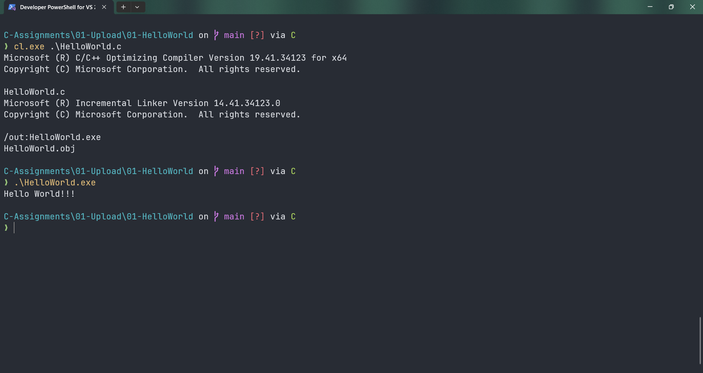

# HelloWorld

Submitted by Yash Pravin Pawar (RTR2024-023)

## Output Screenshots


## Code
### [HelloWorld.c](./01-Code/HelloWorld.c)
```c
#include <stdio.h>

int main(void) 
{
	// Code
	printf("Hello World!!!\n");

	return (0);
}

```
