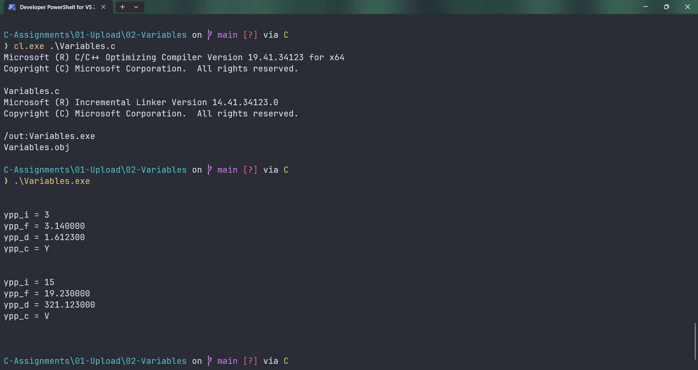

# Variables

Submitted by Yash Pravin Pawar (RTR2024-023)

## Output Screenshots


## Code
### [Variables.c](./01-Code/Variables.c)
```c
#include <stdio.h>

int main(void) 
{
	// Variable Declarations
	int ypp_i = 3;
	float ypp_f = 3.14f;
	double ypp_d = 1.6123;
	char ypp_c = 'Y';

	// Code
	printf("\n\n");

	printf("ypp_i = %d\n", ypp_i);
	printf("ypp_f = %f\n", ypp_f);
	printf("ypp_d = %lf\n", ypp_d);
	printf("ypp_c = %c\n", ypp_c);

	printf("\n\n");

	ypp_i = 15;
	ypp_f = 19.23f;
	ypp_d = 321.123;
	ypp_c = 'V';

	printf("ypp_i = %d\n", ypp_i);
	printf("ypp_f = %f\n", ypp_f);
	printf("ypp_d = %lf\n", ypp_d);
	printf("ypp_c = %c\n", ypp_c);

	printf("\n\n");

	return (0);
}


```
