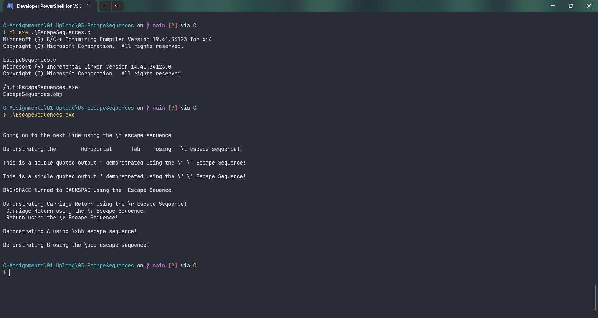

# EscapeSequences

Submitted by Yash Pravin Pawar (RTR2024-023)

## Output Screenshots


## Code
### [EscapeSequences.c](./01-Code/EscapeSequences.c)
```c
#include <stdio.h>

int main(void)
{
	// Code
	printf("\n\n");
	printf("Going on to the next line using the \\n escape sequence \n\n");
	printf("Demonstrating the \t Horizontal \t Tab \t using \t \\t escape sequence!! \n\n");
	printf("This is a double quoted output \" demonstrated using the \\\" \\\" Escape Sequence! \n\n");
	printf("This is a single quoted output \' demonstrated using the \\\' \\\' Escape Sequence! \n\n");
	printf("BACKSPACE turned to BACKSPACE\b using the \\\b Escape Seuence! \n\n");

	printf("\rDemonstrating Carriage Return using the \\r Escape Sequence!\n");
	printf("Demonstrating \r Carriage Return using the \\r Escape Sequence!\n");
	printf("Demonstrating Carriage \r Return using the \\r Escape Sequence!\n\n");

	printf("Demonstrating \x41 using \\xhh escape sequence!\n\n");
	// 0x41 is the Hexadecimal Code for letter 'A'. xhh is the Place-holder for 'x' followed by 2 digit (hh) altogether forming a hexadecimal number
	
	printf("Demonstrating \102 using the \\ooo escape sequence!\n\n");
	// 102 is the Octal Code for letter 'B'. ooo is the Place-Holder for 3 digits forming an octal number
	
	return (0);
}


```
