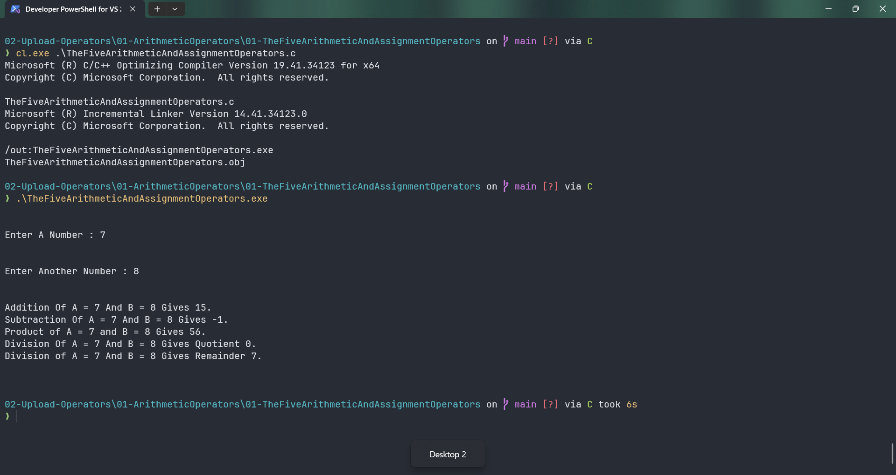

# TheFiveArithmeticAndAssignmentOperators

Submitted by Yash Pravin Pawar (RTR2024-023)

## Output Screenshots


## Code
### [TheFiveArithmeticAndAssignmentOperators.c](./01-Code/TheFiveArithmeticAndAssignmentOperators.c)
```c
#include <stdio.h>

int main(void)
{
	int ypp_a;
	int ypp_b;
	int ypp_result;

	// Code
	printf("\n\n");
	printf("Enter A Number : ");
	scanf("%d", &ypp_a);

	printf("\n\n");
	printf("Enter Another Number : ");
	scanf("%d", &ypp_b);

	printf("\n\n");

	// *** The Following Are teh 5 Arithmetic Operators +, -, *, /, and % ***
	ypp_result = ypp_a + ypp_b;
	printf("Addition Of A = %d And B = %d Gives %d.\n", ypp_a, ypp_b, ypp_result);

	ypp_result = ypp_a - ypp_b;
	printf("Subtraction Of A = %d And B = %d Gives %d.\n", ypp_a, ypp_b, ypp_result);

	ypp_result = ypp_a * ypp_b;
	printf("Product of A = %d and B = %d Gives %d.\n", ypp_a, ypp_b, ypp_result);

	ypp_result = ypp_a / ypp_b;
	printf("Division Of A = %d And B = %d Gives Quotient %d.\n", ypp_a, ypp_b, ypp_result);

	ypp_result = ypp_a % ypp_b;
	printf("Division of A = %d And B = %d Gives Remainder %d.\n", ypp_a, ypp_b, ypp_result);

	printf("\n\n");

	return (0);
}


```
