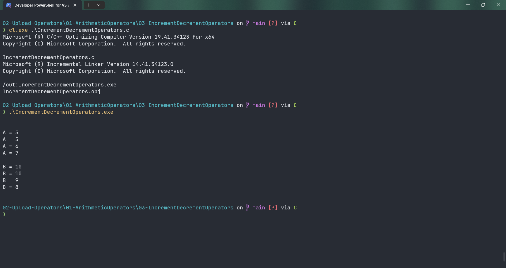

# IncrementDecrementOperators

Submitted by Yash Pravin Pawar (RTR2024-023)

## Output Screenshots


## Code
### [IncrementDecrementOperators.c](./01-Code/IncrementDecrementOperators.c)
```c
#include <stdio.h>

int main(void)
{
	// Variable Declarations
	int ypp_a = 5;
	int ypp_b = 10;

	// Code
	printf("\n\n");
	printf("A = %d\n", ypp_a);
	printf("A = %d\n", ypp_a++);
	printf("A = %d\n", ypp_a);
	printf("A = %d\n\n", ++ypp_a);

	printf("B = %d\n", ypp_b);
	printf("B = %d\n", ypp_b--);
	printf("B = %d\n", ypp_b);
	printf("B = %d\n\n", --ypp_b);

	return (0);
}


```
