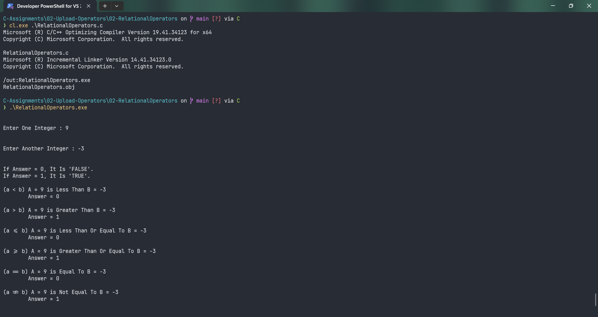

# RelationalOperators

Submitted by Yash Pravin Pawar (RTR2024-023)

## Output Screenshots


## Code
### [RelationalOperators.c](./01-Code/RelationalOperators.c)
```c
#include <stdio.h>

int main(void)
{
	// Variable Declarations
	int ypp_a;
	int ypp_b;
	int ypp_result;

	// Code
	printf("\n\n");
	printf("Enter One Integer : ");
	scanf("%d", &ypp_a);

	printf("\n\n");
	printf("Enter Another Integer : ");
	scanf("%d", &ypp_b);

	printf("\n\n");
	printf("If Answer = 0, It Is 'FALSE'.\n");
	printf("If Answer = 1, It Is 'TRUE'.\n\n");

	ypp_result = (ypp_a < ypp_b);
	printf("(a < b) A = %d is Less Than B = %d \n\tAnswer = %d\n\n", ypp_a, ypp_b, ypp_result);

	ypp_result = (ypp_a > ypp_b);
	printf("(a > b) A = %d is Greater Than B = %d \n\tAnswer = %d\n\n", ypp_a, ypp_b, ypp_result);

	ypp_result = (ypp_a <= ypp_b);
	printf("(a <= b) A = %d is Less Than Or Equal To B = %d \n\tAnswer = %d\n\n", ypp_a, ypp_b, ypp_result);

	ypp_result = (ypp_a >= ypp_b);
	printf("(a >= b) A = %d is Greater Than Or Equal To B = %d \n\tAnswer = %d\n\n", ypp_a, ypp_b, ypp_result);

	ypp_result = (ypp_a == ypp_b);
	printf("(a == b) A = %d is Equal To B = %d \n\tAnswer = %d\n\n", ypp_a, ypp_b, ypp_result);

	ypp_result = (ypp_a != ypp_b);
	printf("(a != b) A = %d is Not Equal To B = %d \n\tAnswer = %d\n\n", ypp_a, ypp_b, ypp_result);

	return (0);
}


```
