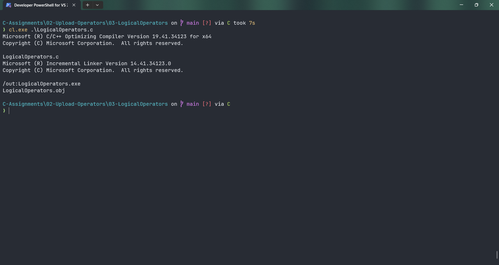
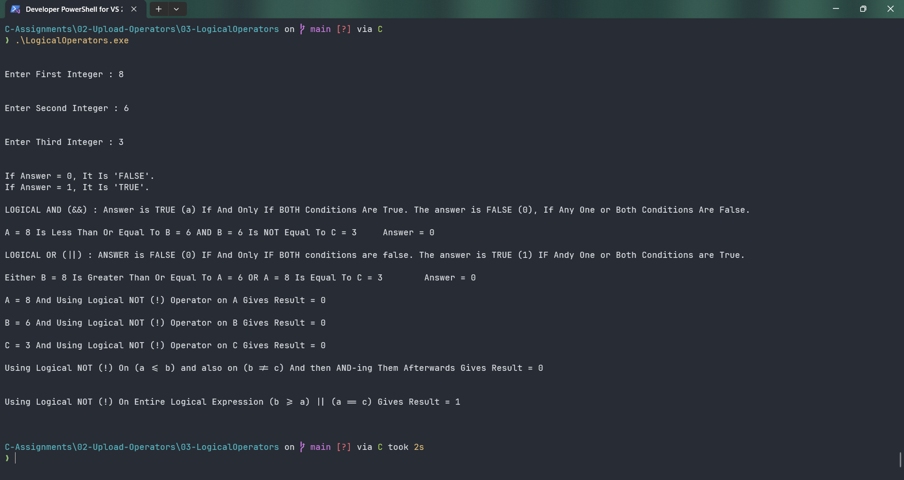

# LogicalOperators

Submitted by Yash Pravin Pawar (RTR2024-023)

## Output Screenshots



## Code
### [LogicalOperators.c](./01-Code/LogicalOperators.c)
```c
#include <stdio.h>

int main(void)
{
	// Variable Declarations
	int ypp_a;
	int ypp_b;
	int ypp_c;
	int ypp_result;

	// Code
	printf("\n\n");
	printf("Enter First Integer : ");
	scanf("%d", &ypp_a);

	printf("\n\n");
	printf("Enter Second Integer : ");
	scanf("%d", &ypp_b);

	printf("\n\n");
	printf("Enter Third Integer : ");
	scanf("%d", &ypp_c);

	printf("\n\n");
	printf("If Answer = 0, It Is 'FALSE'.\n");
	printf("If Answer = 1, It Is 'TRUE'.\n\n");

	ypp_result = (ypp_a <= ypp_b) && (ypp_b != ypp_c);
	printf("LOGICAL AND (&&) : Answer is TRUE (a) If And Only If BOTH Conditions Are True. The answer is FALSE (0), If Any One or Both Conditions Are False.\n\n");
	printf("A = %d Is Less Than Or Equal To B = %d AND B = %d Is NOT Equal To C = %d \t Answer = %d\n\n", ypp_a, ypp_b, ypp_b, ypp_c, ypp_result);

	ypp_result = (ypp_b >= ypp_a) || (ypp_a == ypp_c);
	printf("LOGICAL OR (||) : ANSWER is FALSE (0) IF And Only IF BOTH conditions are false. The answer is TRUE (1) IF Andy One or Both Conditions are True.\n\n");
	printf("Either B = %d Is Greater Than Or Equal To A = %d OR A = %d Is Equal To C = %d \t Answer = %d\n\n", ypp_a, ypp_b, ypp_a, ypp_c, ypp_result);

	ypp_result = !ypp_a;
	printf("A = %d And Using Logical NOT (!) Operator on A Gives Result = %d\n\n", ypp_a, ypp_result);

	ypp_result = !ypp_b;
	printf("B = %d And Using Logical NOT (!) Operator on B Gives Result = %d\n\n", ypp_b, ypp_result);

	ypp_result = !ypp_c;
	printf("C = %d And Using Logical NOT (!) Operator on C Gives Result = %d\n\n", ypp_c, ypp_result);

	ypp_result = (!(ypp_a <= ypp_b) && !(ypp_b != ypp_c));	
	printf("Using Logical NOT (!) On (a <= b) and also on (b != c) And then AND-ing Them Afterwards Gives Result = %d\n", ypp_result);

	printf("\n\n");

	ypp_result = !((ypp_b >= ypp_a) || (ypp_a == ypp_c));
	printf("Using Logical NOT (!) On Entire Logical Expression (b >= a) || (a == c) Gives Result = %d\n", ypp_result);

	printf("\n\n");

	return 0;
}


```
