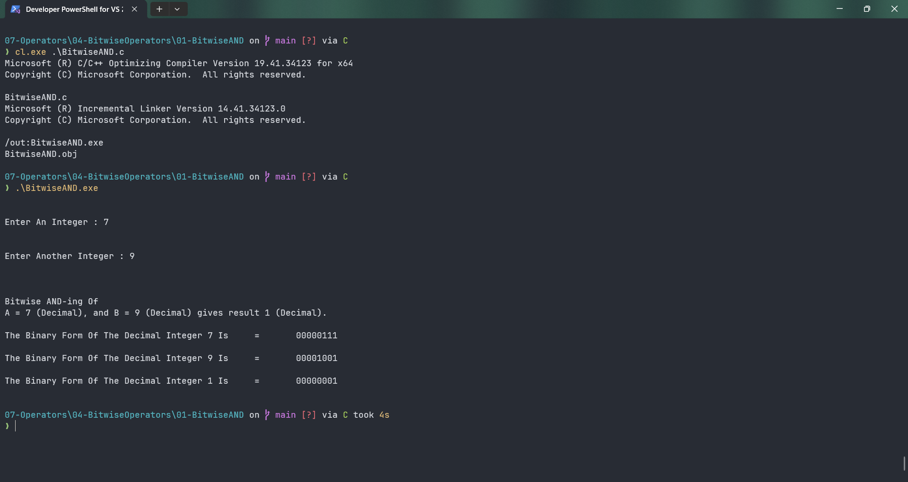

# BitwiseAND

Submitted by Yash Pravin Pawar (RTR2024-023)

## Output Screenshots


## Code
### [BitwiseAND.c](./01-Code/BitwiseAND.c)
```c
#include <stdio.h>

int main(void)
{
	// function prototypes
	void PrintBinaryFormOfNumber(unsigned int);

	// Variable declarations
	unsigned int ypp_a;
	unsigned int ypp_b;
	unsigned int ypp_result;

	// Code
	printf("\n\n");
	printf("Enter An Integer : ");
	scanf("%u", &ypp_a);

	printf("\n\n");
	printf("Enter Another Integer : ");
	scanf("%u", &ypp_b);

	ypp_result = ypp_a & ypp_b;
	printf("\n\n\n");
	printf("Bitwise AND-ing Of \nA = %d (Decimal), and B = %d (Decimal) gives result %d (Decimal).\n\n", ypp_a, ypp_b, ypp_result);

	PrintBinaryFormOfNumber(ypp_a);
	PrintBinaryFormOfNumber(ypp_b);
	PrintBinaryFormOfNumber(ypp_result);

	return (0);
}

void PrintBinaryFormOfNumber(unsigned int ypp_decimal_number)
{
	unsigned int ypp_quotient, ypp_remainder;
	unsigned int ypp_num;
	unsigned int ypp_binary_array[8];
	int ypp_i;

	// Code
	for (ypp_i = 0; ypp_i < 8; ypp_i++)
		ypp_binary_array[ypp_i] = 0;

	printf("The Binary Form Of The Decimal Integer %d Is\t=\t", ypp_decimal_number);

	ypp_num = ypp_decimal_number;
	ypp_i = 7;

	while (ypp_num != 0)
	{
		ypp_quotient = ypp_num / 2;
		ypp_remainder = ypp_num % 2;
		ypp_binary_array[ypp_i] = ypp_remainder;
		ypp_num = ypp_quotient;
		ypp_i--;
	}

	for (ypp_i = 0; ypp_i < 8; ypp_i++)
		printf("%u", ypp_binary_array[ypp_i]);

	printf("\n\n");
}


```
