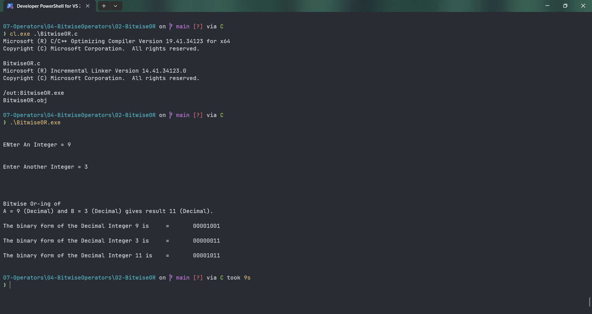

# BitwiseOR

Submitted by Yash Pravin Pawar (RTR2024-023)

## Output Screenshots


## Code
### [BitwiseOR.c](./01-Code/BitwiseOR.c)
```c
#include <stdio.h>

int main(void)
{
    // function prototypes
    void PrintBinaryFormOfNumber(unsigned int);

    unsigned int ypp_a;
    unsigned int ypp_b, ypp_result;

    // code
    printf("\n\n");
    printf("ENter An Integer = ");
    scanf("%u", &ypp_a);

    printf("\n\n");
    printf("Enter Another Integer = ");
    scanf("%u", &ypp_b);
    
    printf("\n\n\n\n");
    ypp_result = ypp_a | ypp_b;
    printf("Bitwise Or-ing of \nA = %d (Decimal) and B = %d (Decimal) gives result %d (Decimal).\n\n", ypp_a, ypp_b, ypp_result);

    PrintBinaryFormOfNumber(ypp_a);
    PrintBinaryFormOfNumber(ypp_b);
    PrintBinaryFormOfNumber(ypp_result);
}

void PrintBinaryFormOfNumber(unsigned int ypp_dec_no) {
    // variable declarations
    unsigned int ypp_quotient, ypp_remainder;
    unsigned int ypp_num;
    unsigned int binary_array[8] = {0};
    int ypp_i;

    //code
    printf("The binary form of the Decimal Integer %d is \t=\t", ypp_dec_no);

    ypp_num = ypp_dec_no;

    ypp_i = 7;
    while (ypp_num != 0) {
        ypp_quotient = ypp_num / 2;
        ypp_remainder = ypp_num % 2;
        binary_array[ypp_i] = ypp_remainder;

        ypp_num = ypp_quotient;
        ypp_i--;
    }

    for (ypp_i = 0; ypp_i < 8; ypp_i++)
        printf("%u", binary_array[ypp_i]);

    printf("\n\n");
}

```
