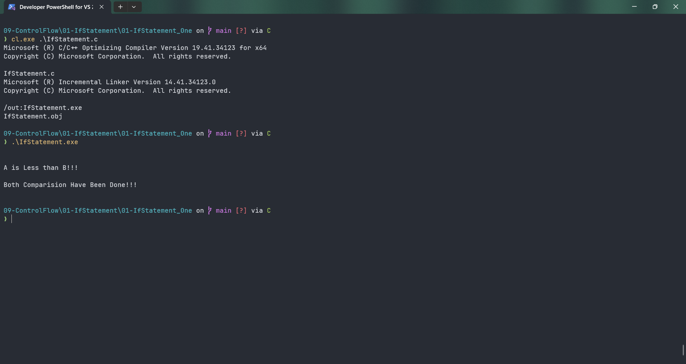

# IfStatement

Submitted by Yash Pravin Pawar (RTR2024-023)

## Output Screenshots


## Code
### [IfStatement.c](./01-Code/IfStatement.c)
```c
#include <stdio.h>

int main(void)
{
    int ypp_a, ypp_b, ypp_p;

    ypp_a = 9;
    ypp_b = 30;
    ypp_p = 30;

    printf("\n\n");

    if (ypp_a < ypp_b)
    {
        printf("A is Less than B!!! \n\n");
    }

    if (ypp_b != ypp_p)
    {
        printf("B is Not Equal to P!!! \n\n");
    }

    printf("Both Comparision Have Been Done!!!\n\n");

    return (0);
}

```
