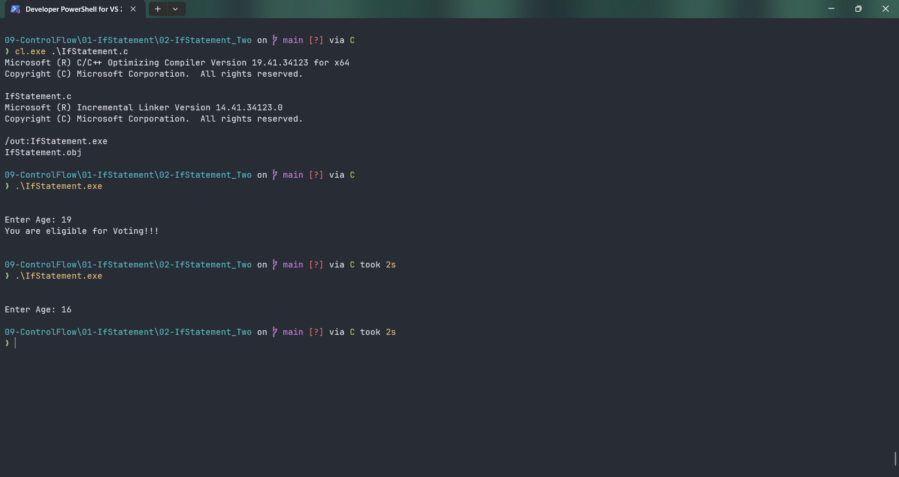

# IfStatement

Submitted by Yash Pravin Pawar (RTR2024-023)

## Output Screenshots


## Code
### [IfStatement.c](./01-Code/IfStatement.c)
```c
#include <stdio.h>

int main(void)
{
    // variable declarations
    int age;

    // code
    printf("\n\n");
    printf("Enter Age: ");
    scanf("%d", &age);

    if (age >= 18)
    {
        printf("You are eligible for Voting!!!\n\n");
    }

    return (0);
}
```
