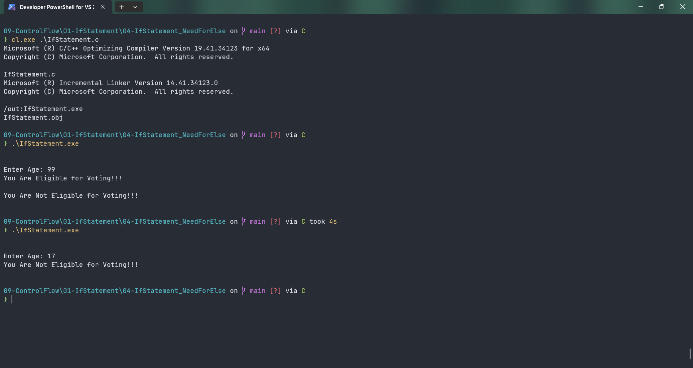

# IfStatement

Submitted by Yash Pravin Pawar (RTR2024-023)

## Output Screenshots


## Code
### [IfStatement.c](./01-Code/IfStatement.c)
```c
#include <stdio.h>

int main(void)
{
    int ypp_age;

    printf("\n\n");
    printf("Enter Age: ");
    scanf("%d", &ypp_age);

    if (ypp_age >= 18)
    {
        printf("You Are Eligible for Voting!!!\n\n");
    }
    printf("You Are Not Eligible for Voting!!!\n\n");

    return (0);
}

```
