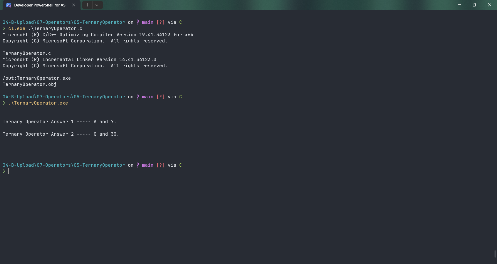

# TernaryOperator

Submitted by Yash Pravin Pawar (RTR2024-023)

## Output Screenshots


## Code
### [TernaryOperator.c](./01-Code/TernaryOperator.c)
```c
#include <stdio.h>

int main(void)
{
    int ypp_a, ypp_b;
    int ypp_p, ypp_q;
    char ypp_ch_result_01, ypp_ch_result_02;
    int ypp_i_result_01, ypp_i_result_02;

    // code
    printf("\n\n");

    ypp_a = 7;
    ypp_b = 5;

    ypp_ch_result_01 = (ypp_a > ypp_b) ? 'A' : 'B';
    ypp_i_result_01 = (ypp_a > ypp_b) ? ypp_a : ypp_b;
    printf("Ternary Operator Answer 1 ----- %c and %d.\n\n", ypp_ch_result_01, ypp_i_result_01);

    ypp_p = 30;
    ypp_q = 30;
    ypp_ch_result_02 = (ypp_p != ypp_q) ? 'P' : 'Q';
    ypp_i_result_02 = (ypp_p != ypp_q) ? ypp_p : ypp_q;

    printf("Ternary Operator Answer 2 ----- %c and %d.\n\n", ypp_ch_result_02, ypp_i_result_02);

    printf("\n\n");
    return (0);
}

```
