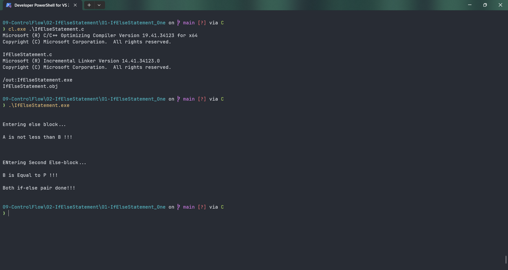

# IfElseStatement

Submitted by Yash Pravin Pawar (RTR2024-023)

## Output Screenshots


## Code
### [IfElseStatement.c](./01-Code/IfElseStatement.c)
```c
#include <stdio.h>

int main(void)
{
    int ypp_a, ypp_b, ypp_p;

    // code
    ypp_a = 9;
    ypp_b = 30;
    ypp_p = 30;

    printf("\n\n");
    if (ypp_a > ypp_b)
    {
        printf("ENtering first if-block...\n\n");
        printf("A is less than B!!!\n\n");
    }
    else 
    {
        printf("Entering else block...\n\n");
        printf("A is not less than B !!!\n\n");
    }

    printf("\n\n");
    if (ypp_b != ypp_p)
    {
        printf("Entering second if-block...\n\n");
        printf("B is not equal to P !!!\n\n");
    }
    else 
    {
        printf("ENtering Second Else-block...\n\n");
        printf("B is Equal to P !!!\n\n");
    }

    printf("Both if-else pair done!!!\n\n");

    return (0);
}
```
