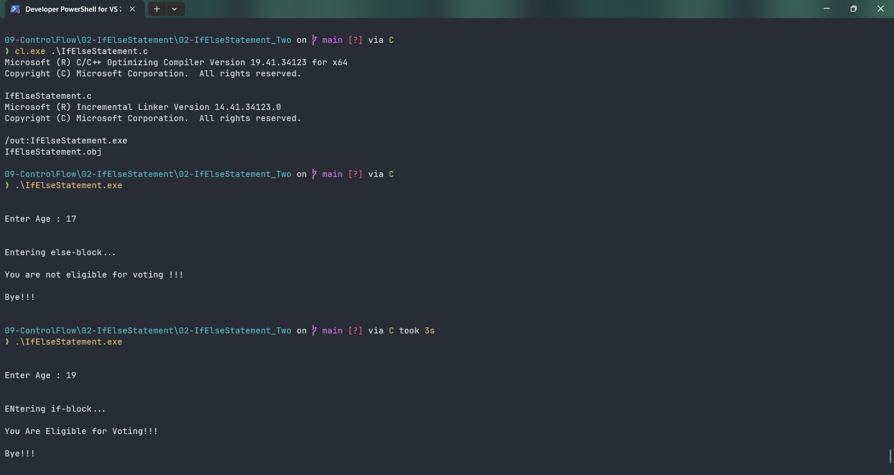

# IfElseStatement

Submitted by Yash Pravin Pawar (RTR2024-023)

## Output Screenshots


## Code
### [IfElseStatement.c](./01-Code/IfElseStatement.c)
```c
#include <stdio.h>

int main(void)
{
    int ypp_age;

    printf("\n\n");
    printf("Enter Age : ");
    scanf("%d", &ypp_age);
    printf("\n\n");

    if (ypp_age >= 18)
    {
        printf("ENtering if-block...\n\n");
        printf("You Are Eligible for Voting!!!\n\n");
    }
    else 
    {
        printf("Entering else-block...\n\n");
        printf("You are not eligible for voting !!!\n\n");
    }

    printf("Bye!!!\n\n");

    return (0);
}
```
