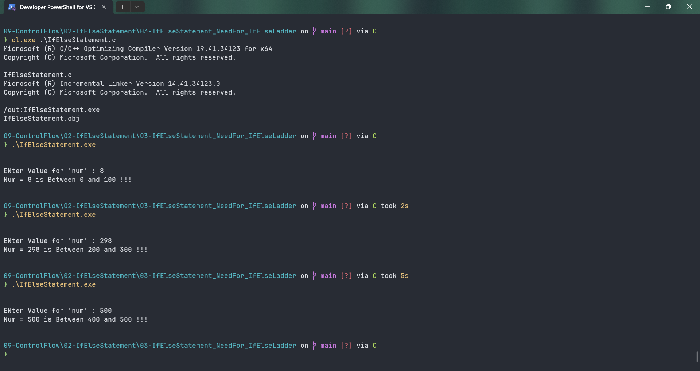

# IfElseStatement

Submitted by Yash Pravin Pawar (RTR2024-023)

## Output Screenshots


## Code
### [IfElseStatement.c](./01-Code/IfElseStatement.c)
```c
#include <stdio.h>

int main(void)
{
    // variable declarations
    int ypp_num;

    // code
    printf("\n\n");
    printf("ENter Value for 'num' : ");
    scanf("%d", &ypp_num);

    if (ypp_num < 0)
    {
        printf("Num = %d is less than 0 (negative) !!!\n\n", ypp_num);
    }
    else
    {
        if ((ypp_num > 0) && (ypp_num <= 100))
        {
            printf("Num = %d is Between 0 and 100 !!!\n\n", ypp_num);
        }
        else
        {

            if ((ypp_num > 100) && (ypp_num <= 200))
            {
                printf("Num = %d is Between 100 and 200 !!!\n\n", ypp_num);
            }
            else
            {

                if ((ypp_num > 200) && (ypp_num <= 300))
                {
                    printf("Num = %d is Between 200 and 300 !!!\n\n", ypp_num);
                }
                else
                {

                    if ((ypp_num > 300) && (ypp_num <= 400))
                    {
                        printf("Num = %d is Between 300 and 400 !!!\n\n", ypp_num);
                    }
                    else
                    {

                        if ((ypp_num > 400) && (ypp_num <= 500))
                        {
                            printf("Num = %d is Between 400 and 500 !!!\n\n", ypp_num);
                        }
                        else
                        {
                            printf("Num = %d is greater than 500!!!\n\n", ypp_num);
                        }
                    }
                }
            }
        }
    }

    return (0);
}

```
