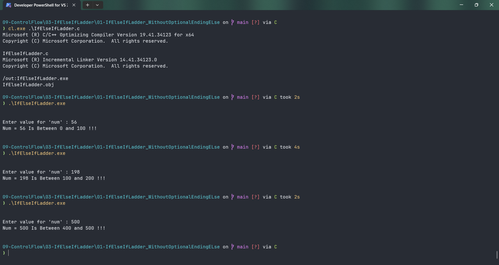

# IfElseIfLadder

Submitted by Yash Pravin Pawar (RTR2024-023)

## Output Screenshots


## Code
### [IfElseIfLadder.c](./01-Code/IfElseIfLadder.c)
```c
#include <stdio.h>

int main(void)
{
    int ypp_num;

    printf("\n\n");
    printf("Enter value for 'num' : ");
    scanf("%d", &ypp_num);

    if (ypp_num < 0)
    {
        printf("Num %d is less than 0 (negative) !!!\n\n", ypp_num);
    }
    else if ((ypp_num > 0) && (ypp_num <= 100))
        printf("Num = %d Is Between 0 and 100 !!!\n\n", ypp_num);

    else if ((ypp_num > 100) && (ypp_num <= 200))
        printf("Num = %d Is Between 100 and 200 !!!\n\n", ypp_num);
    
    else if ((ypp_num > 200) && (ypp_num <= 300))
        printf("Num = %d Is Between 200 and 300 !!!\n\n", ypp_num);
    
    else if ((ypp_num > 300) && (ypp_num <= 400))
        printf("Num = %d Is Between 300 and 400 !!!\n\n", ypp_num);
    
    else if ((ypp_num > 400) && (ypp_num <= 500))
        printf("Num = %d Is Between 400 and 500 !!!\n\n", ypp_num);
    
    else if (ypp_num > 500)
        printf("Num = %d Is Greater Than 500!!! \n\n", ypp_num);

    return (0);
}

```
