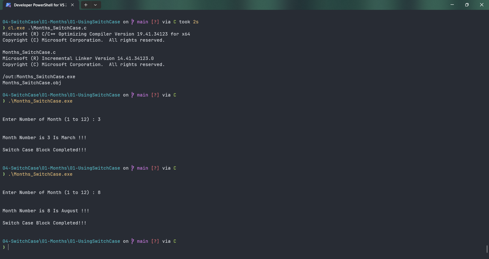

# Months_SwitchCase

Submitted by Yash Pravin Pawar (RTR2024-023)

## Output Screenshots


## Code
### [Months_SwitchCase.c](./01-Code/Months_SwitchCase.c)
```c
#include <stdio.h>

int main(void)
{
    int ypp_num_month;

    printf("\n\n");
    printf("Enter Number of Month (1 to 12) : ");
    scanf("%d", &ypp_num_month);

    printf("\n\n");

    switch (ypp_num_month)
    {
        case 1:
            printf("Month Number is %d Is January !!!\n\n", ypp_num_month);
            break;
        case 2:
            printf("Month Number is %d Is February !!!\n\n", ypp_num_month);
            break;
        case 3:
            printf("Month Number is %d Is March !!!\n\n", ypp_num_month);
            break;
        case 4:
            printf("Month Number is %d Is April !!!\n\n", ypp_num_month);
            break;
        case 5:
            printf("Month Number is %d Is May !!!\n\n", ypp_num_month);
            break;
        case 6:
            printf("Month Number is %d Is June !!!\n\n", ypp_num_month);
            break;
        case 7:
            printf("Month Number is %d Is July !!!\n\n", ypp_num_month);
            break;
        case 8:
            printf("Month Number is %d Is August !!!\n\n", ypp_num_month);
            break;
        case 9:
            printf("Month Number is %d Is September !!!\n\n", ypp_num_month);
            break;
        case 10:    
            printf("Month Number is %d Is October !!!\n\n", ypp_num_month);
            break;
        case 11:
            printf("Month Number is %d Is November !!!\n\n", ypp_num_month);
            break;
        case 12:
            printf("Month Number is %d Is December !!!\n\n", ypp_num_month);
            break;
        default:
            printf("Invalid Month Number %d Entered!!! Please Try Again...\n\n", ypp_num_month);
            break;
    }

    printf("Switch Case Block Completed!!!\n\n");

    return (0);
}

```
