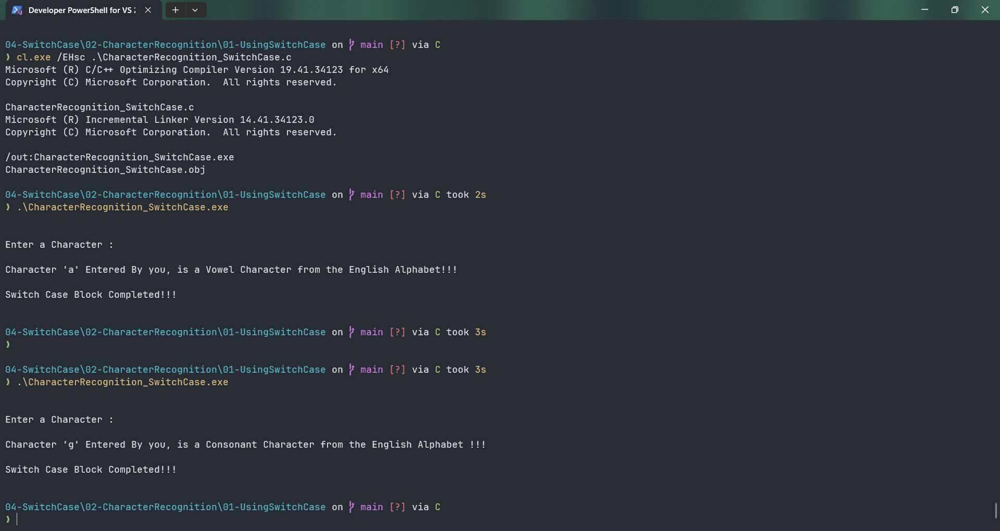

# CharacterRecognition_SwitchCase

Submitted by Yash Pravin Pawar (RTR2024-023)

## Output Screenshots


## Code
### [CharacterRecognition_SwitchCase.c](./01-Code/CharacterRecognition_SwitchCase.c)
```c
#include <stdio.h>
#include <conio.h>

// ASCII Values or 'A' to 'Z' -> 65 to 90
#define CHAR_ALPHABET_UPPER_CASE_BEGINNING 65
#define CHAR_ALPHABET_UPPER_CASE_ENDING 90

// ASCII Values or 'a' to 'z' -> 97 to 122
#define CHAR_ALPHABET_LOWER_CASE_BEGINNING 97
#define CHAR_ALPHABET_LOWER_CASE_ENDING 122

// ASCII Values or '0' to '9' -> 48 to 57
#define CHAR_DIGIT_BEGINNING 48
#define CHAR_DIGIT_ENDING 57

int main(void)
{
    char ypp_ch;
    int ypp_ch_value;

    // code
    printf("\n\n");

    printf("Enter a Character : ");
    ypp_ch = getch();

    printf("\n\n");

    switch (ypp_ch)
    {
        case 'A':
        case 'a':
        case 'E':
        case 'e':
        case 'I':
        case 'i':
        case 'O':
        case 'o':
        case 'U':
        case 'u':
            printf("Character '%c' Entered By you, is a Vowel Character from the English Alphabet!!!\n\n", ypp_ch);
            break;
        default:
            ypp_ch_value = (int)ypp_ch;

            if ((ypp_ch_value >= CHAR_ALPHABET_UPPER_CASE_BEGINNING) && (ypp_ch_value <= CHAR_ALPHABET_UPPER_CASE_ENDING) || (ypp_ch_value >= CHAR_ALPHABET_LOWER_CASE_BEGINNING) && (ypp_ch_value <= CHAR_ALPHABET_LOWER_CASE_ENDING))
                printf("Character '%c' Entered By you, is a Consonant Character from the English Alphabet !!!\n\n", ypp_ch);
            
            else if ((ypp_ch_value >= CHAR_DIGIT_BEGINNING) && (ypp_ch_value <= CHAR_DIGIT_ENDING))
                printf("Character '%c' Entered By you, is a Digit Character !!!\n\n", ypp_ch);
            
            else
                printf("Character '%c' Entered By you, is a Special Character !!!\n\n", ypp_ch);
    }

    printf("Switch Case Block Completed!!!\n\n");

    return (0);
}

```
