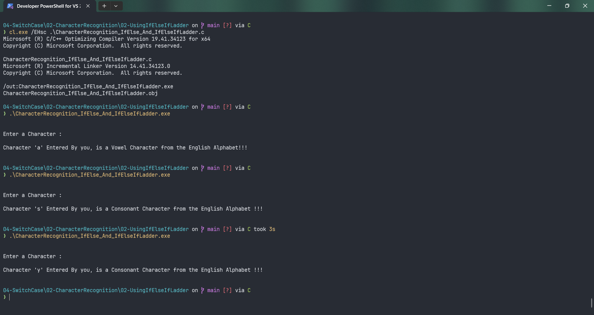

# CharacterRecognition_IfElse_And_IfElseIfLadder

Submitted by Yash Pravin Pawar (RTR2024-023)

## Output Screenshots


## Code
### [CharacterRecognition_IfElse_And_IfElseIfLadder.c](./01-Code/CharacterRecognition_IfElse_And_IfElseIfLadder.c)
```c
#include <stdio.h>
#include <conio.h>

// ASCII Values or 'A' to 'Z' -> 65 to 90
#define CHAR_ALPHABET_UPPER_CASE_BEGINNING 65
#define CHAR_ALPHABET_UPPER_CASE_ENDING 90

// ASCII Values or 'a' to 'z' -> 97 to 122
#define CHAR_ALPHABET_LOWER_CASE_BEGINNING 97
#define CHAR_ALPHABET_LOWER_CASE_ENDING 122

// ASCII Values or '0' to '9' -> 48 to 57
#define CHAR_DIGIT_BEGINNING 48
#define CHAR_DIGIT_ENDING 57

int main(void)
{
    char ypp_ch;
    int ypp_ch_value;

    // code
    printf("\n\n");

    printf("Enter a Character : ");
    ypp_ch = getch();

    printf("\n\n");

    if ((ypp_ch == 'A' || ypp_ch == 'a') || (ypp_ch == 'E' || ypp_ch == 'e') || (ypp_ch == 'I' || ypp_ch == 'i') || (ypp_ch == 'O' || ypp_ch == 'o') || (ypp_ch == 'U' || ypp_ch == 'u'))
        printf("Character '%c' Entered By you, is a Vowel Character from the English Alphabet!!!\n\n", ypp_ch);

    else
    {
        ypp_ch_value = (int)ypp_ch;

        if ((ypp_ch_value >= CHAR_ALPHABET_UPPER_CASE_BEGINNING) && (ypp_ch_value <= CHAR_ALPHABET_UPPER_CASE_ENDING) || (ypp_ch_value >= CHAR_ALPHABET_LOWER_CASE_BEGINNING) && (ypp_ch_value <= CHAR_ALPHABET_LOWER_CASE_ENDING))
            printf("Character '%c' Entered By you, is a Consonant Character from the English Alphabet !!!\n\n", ypp_ch);

        else if ((ypp_ch_value >= CHAR_DIGIT_BEGINNING) && (ypp_ch_value <= CHAR_DIGIT_ENDING))
            printf("Character '%c' Entered By you, is a Digit Character !!!\n\n", ypp_ch);

        else
            printf("Character '%c' Entered By you, is a Special Character !!!\n\n", ypp_ch);
    }

    return (0);
}

```
