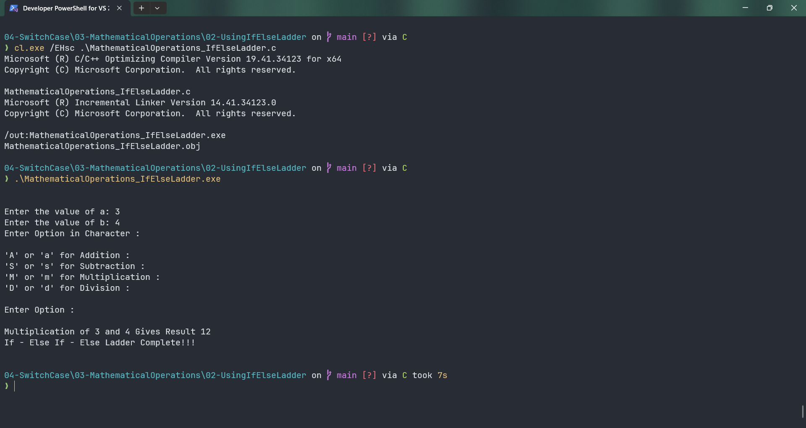
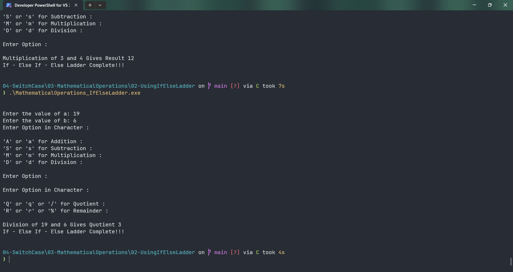

# MathematicalOperations_IfElseLadder

Submitted by Yash Pravin Pawar (RTR2024-023)

## Output Screenshots



## Code
### [MathematicalOperations_IfElseLadder.c](./01-Code/MathematicalOperations_IfElseLadder.c)
```c
#include <stdio.h>
#include <conio.h>

int main(void)
{
    int ypp_a, ypp_b;
    int ypp_result;

    char ypp_option, ypp_option_division;

    printf("\n\n");
    printf("Enter the value of a: ");
    scanf("%d", &ypp_a);

    printf("Enter the value of b: ");
    scanf("%d", &ypp_b);

    printf("Enter Option in Character : \n\n");
    printf("'A' or 'a' for Addition : \n");
    printf("'S' or 's' for Subtraction : \n");
    printf("'M' or 'm' for Multiplication : \n");
    printf("'D' or 'd' for Division : \n\n");
    printf("Enter Option : ");
    ypp_option = getch();

    printf("\n\n");

    if (ypp_option == 'A' || ypp_option == 'a')
    {
        ypp_result = ypp_a + ypp_b;
        printf("Addition of %d and %d Gives Result %d\n", ypp_a, ypp_b, ypp_result);
    }

    else if (ypp_option == 'S' || ypp_option == 's')
    {
        if (ypp_a >= ypp_b)
        {
            ypp_result = ypp_a - ypp_b;
            printf("Subtraction of %d and %d Gives Result %d\n", ypp_a, ypp_b, ypp_result);
        }
        else
        {
            ypp_result = ypp_b - ypp_a;
            printf("Subtraction of %d and %d Gives Result %d\n", ypp_b, ypp_a, ypp_result);
        }
    }

    else if (ypp_option == 'M' || ypp_option == 'm')
    {
        ypp_result = ypp_a * ypp_b;
        printf("Multiplication of %d and %d Gives Result %d\n", ypp_a, ypp_b, ypp_result);
    }

    else if (ypp_option == 'D' || ypp_option == 'd')
    {
        printf("Enter Option in Character : \n\n");
        printf("'Q' or 'q' or '/' for Quotient : \n");
        printf("'R' or 'r' or '%%' for Remainder : \n\n");
        ypp_option_division = getch();

        if (ypp_option_division == 'Q' || ypp_option_division == 'q' || ypp_option_division == '/')
        {
            ypp_result = ypp_a / ypp_b;
            printf("Division of %d and %d Gives Quotient %d\n", ypp_a, ypp_b, ypp_result);
        }

        else if (ypp_option_division == 'R' || ypp_option_division == 'r' || ypp_option_division == '%')
        {
            ypp_result = ypp_a % ypp_b;
            printf("Division of %d and %d Gives Remainder %d\n", ypp_a, ypp_b, ypp_result);
        }
    }

    else
    {
        printf("Invalid Option Character %c Entered !!! Please Try again...\n\n", ypp_option);
    }

    printf("If - Else If - Else Ladder Complete!!!\n\n");

    return (0);
}

```
