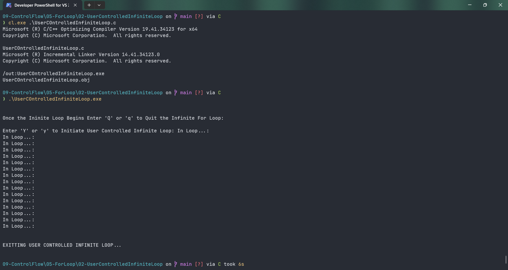

# UserCOntrolledInfiniteLoop

Submitted by Yash Pravin Pawar (RTR2024-023)

## Output Screenshots


## Code
### [UserCOntrolledInfiniteLoop.c](./01-Code/UserCOntrolledInfiniteLoop.c)
```c
#include <stdio.h>

int main(void)
{
    char ypp_option, ypp_ch = '\0';

    printf("\n\n");
    printf("Once the Ininite Loop Begins Enter 'Q' or 'q' to Quit the Infinite For Loop: \n\n");
    printf("Enter 'Y' or 'y' to Initiate User Controlled Infinite Loop: ");
    ypp_option = getch();

    if ( ypp_option == 'Y' || ypp_option == 'y' )
    {
        for ( ; ; )
        {
            printf("In Loop...: \n");
            ypp_ch = getch();
            if ( ypp_ch == 'Q' || ypp_ch == 'q' )
            {
                break;
            }
        }
    }

    printf("\n\n");
    printf("EXITTING USER CONTROLLED INFINITE LOOP...");
    printf("\n\n");

    return (0);
}


```
