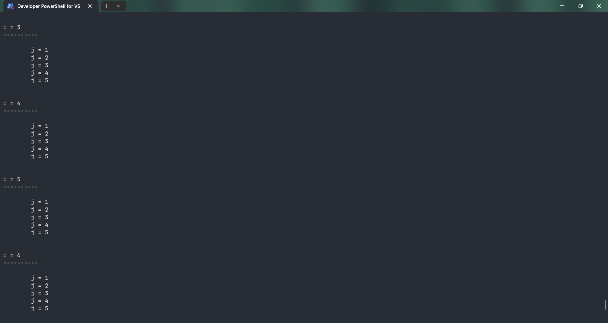
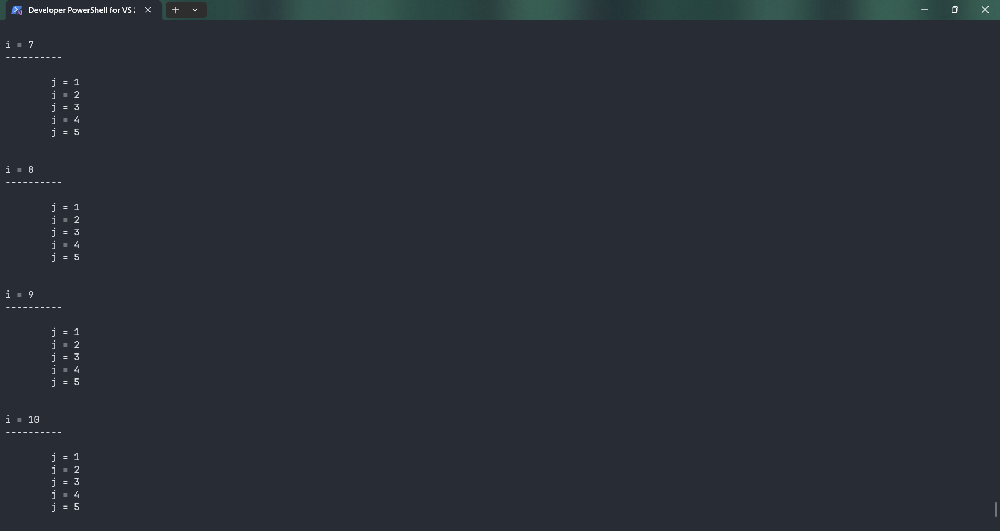

# NestedForLoop_One

Submitted by Yash Pravin Pawar (RTR2024-023)

## Output Screenshots




## Code
### [NestedForLoop_One.c](./01-Code/NestedForLoop_One.c)
```c
#include <stdio.h>

int main(void)
{
    int ypp_i, ypp_j;

    printf("\n\n");

    for (ypp_i = 1; ypp_i <= 10; ypp_i++)
    {
        printf("i = %d\n", ypp_i);
        printf("----------\n\n");
        for (ypp_j = 1; ypp_j <= 5; ypp_j++)
        {
            printf("\tj = %d\n", ypp_j);
        }
        printf("\n\n");
    }

    return (0);
}

```
