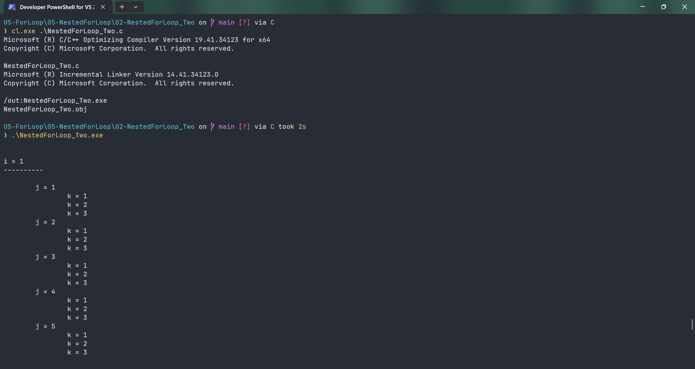
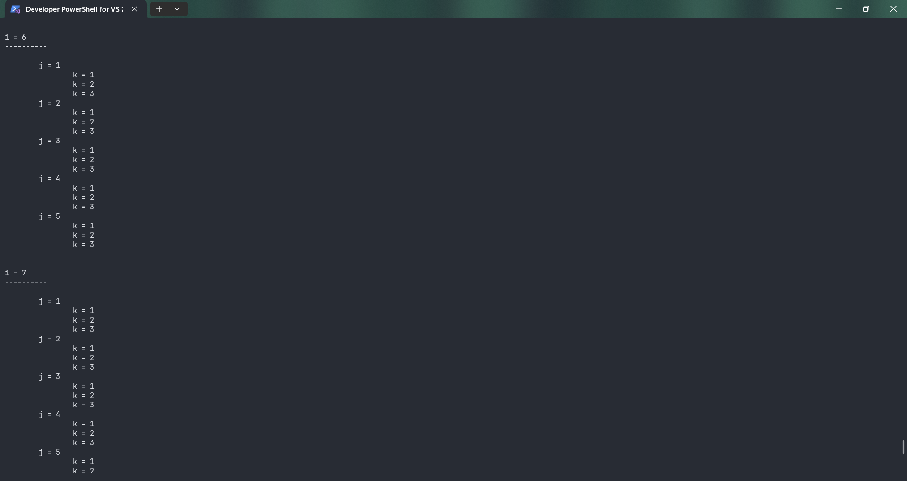
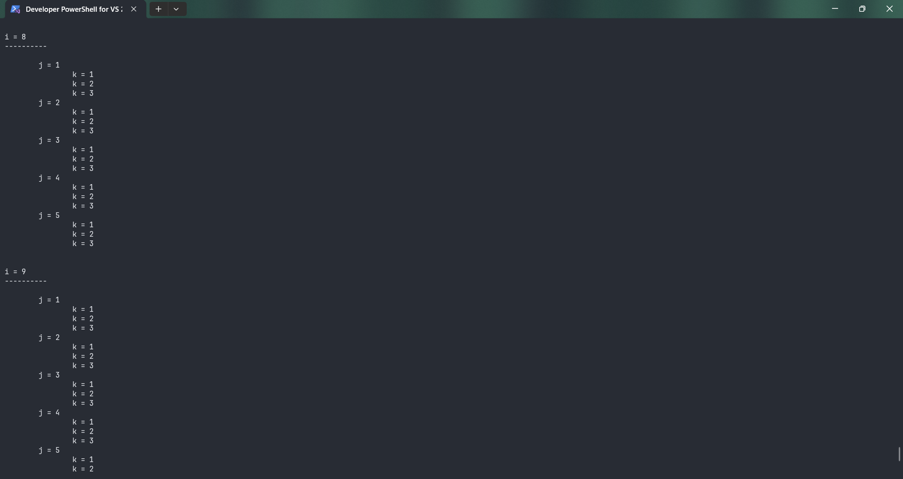
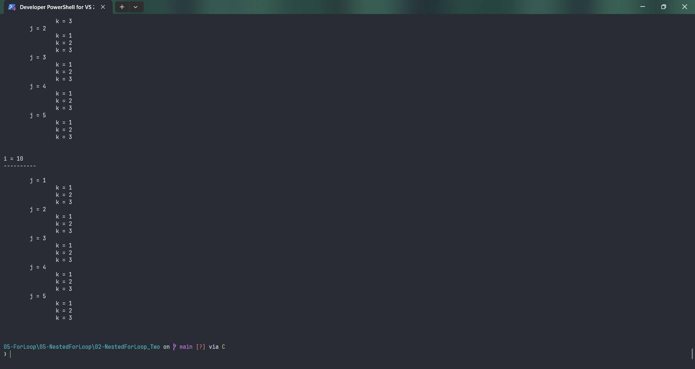

# NestedForLoop_Two

Submitted by Yash Pravin Pawar (RTR2024-023)

## Output Screenshots







## Code
### [NestedForLoop_Two.c](./01-Code/NestedForLoop_Two.c)
```c
#include <stdio.h>

int main(void)
{
    int ypp_i, ypp_j, ypp_k;

    printf("\n\n");
    for (ypp_i = 1; ypp_i <= 10; ypp_i++)
    {
        printf("i = %d\n", ypp_i);
        printf("----------\n\n");
        for (ypp_j = 1; ypp_j <= 5; ypp_j++)
        {
            printf("\tj = %d\n", ypp_j);
            for (ypp_k = 1; ypp_k <= 3; ypp_k++)
            {
                printf("\t\tk = %d\n", ypp_k);
            }
        }
        printf("\n\n");
    }

    return (0);
}

```
