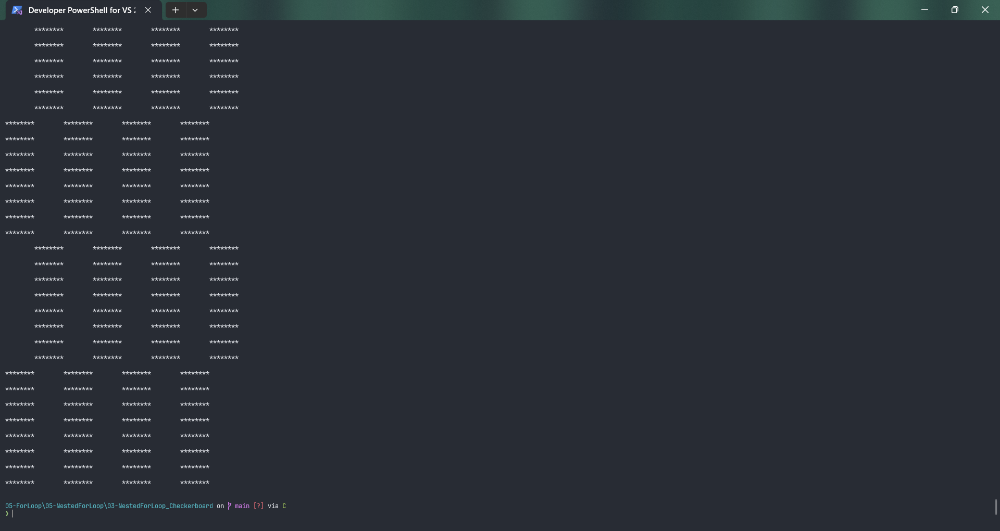
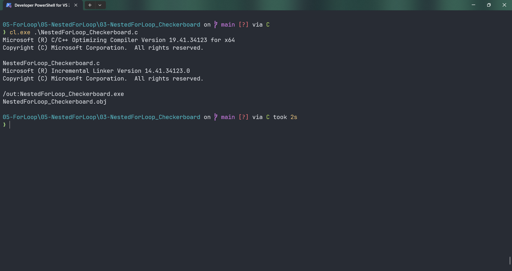
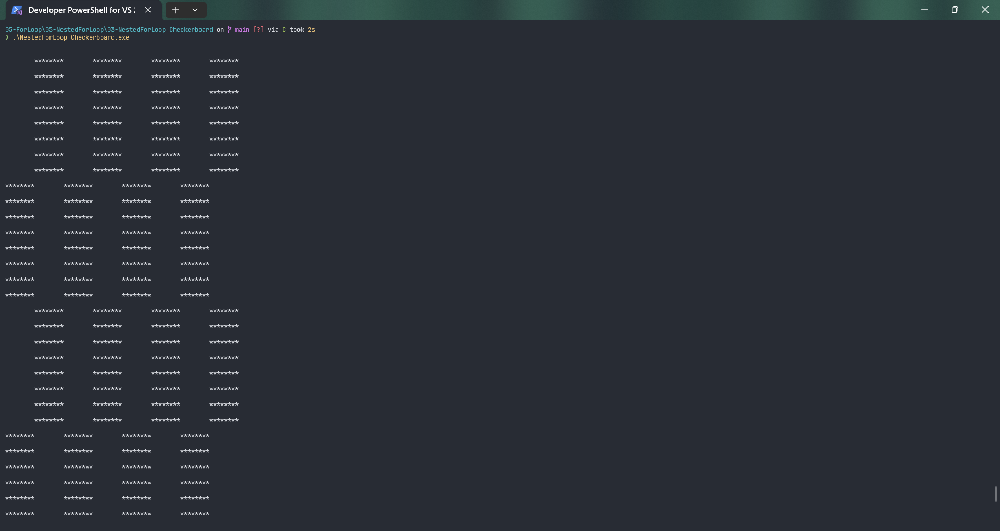

# NestedForLoop_Checkerboard

Submitted by Yash Pravin Pawar (RTR2024-023)

## Output Screenshots




## Code
### [NestedForLoop_Checkerboard.c](./01-Code/NestedForLoop_Checkerboard.c)
```c
#include <stdio.h>

int main(void)
{
    int ypp_i, ypp_j, ypp_c;

    printf("\n\n");
    for (ypp_i = 0; ypp_i < 64; ypp_i++)
    {
        for (ypp_j = 0; ypp_j < 64; ypp_j++)
        {
            ypp_c = (((ypp_i & 0x8) == 0) ^ ((ypp_j & 0x8) == 0));

            if (ypp_c == 0)
            {
                printf(" ");
            }

            if (ypp_c == 1)
            {
                printf("*");
            }
        }
        printf("\n\n");
    }

    return (0);
}

```
