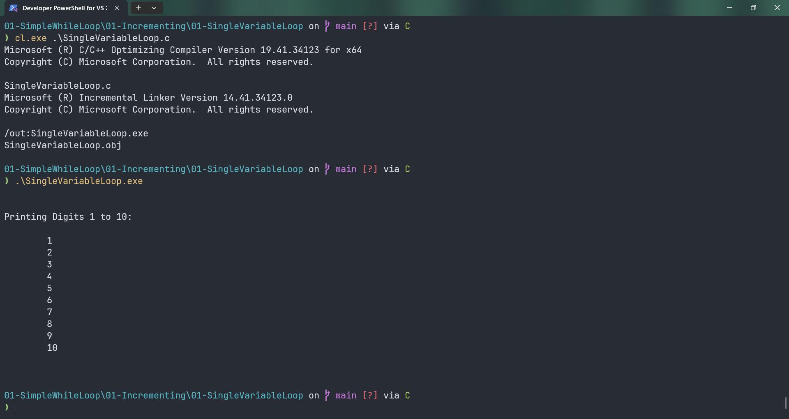

# SingleVariableLoop

Submitted by Yash Pravin Pawar (RTR2024-023)

## Output Screenshots


## Code
### [SingleVariableLoop.c](./01-Code/SingleVariableLoop.c)
```c
#include <stdio.h>

int main(void)
{
    int ypp_i = 1;

    printf("\n\n");
    printf("Printing Digits 1 to 10: \n\n");

    while (ypp_i <= 10)
    {
        printf("\t%d\n", ypp_i);
        ypp_i++;
    }

    printf("\n\n");

    return (0);
}

```
