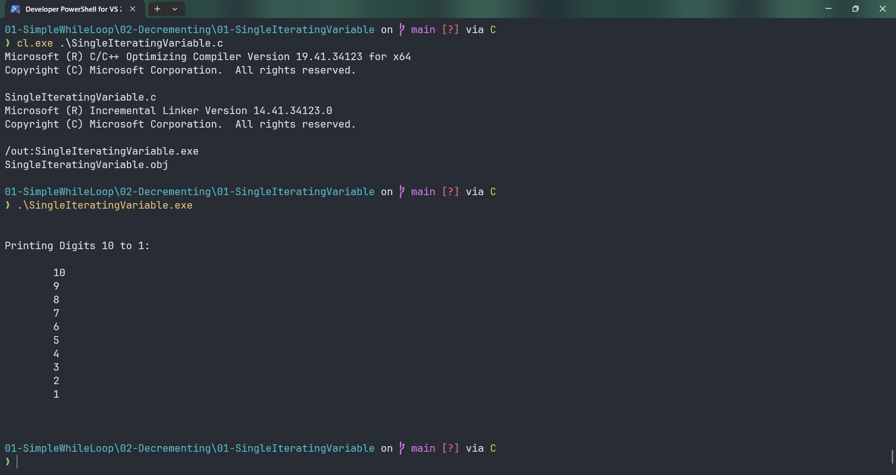

# SingleIteratingVariable

Submitted by Yash Pravin Pawar (RTR2024-023)

## Output Screenshots


## Code
### [SingleIteratingVariable.c](./01-Code/SingleIteratingVariable.c)
```c
#include <stdio.h>  

int main(void)
{
    int ypp_i = 10;

    printf("\n\n");
    printf("Printing Digits 10 to 1: \n\n");

    while (ypp_i >= 1)
    {
        printf("\t%d\n", ypp_i);
        ypp_i--;
    }

    printf("\n\n");

    return (0);
}


```
