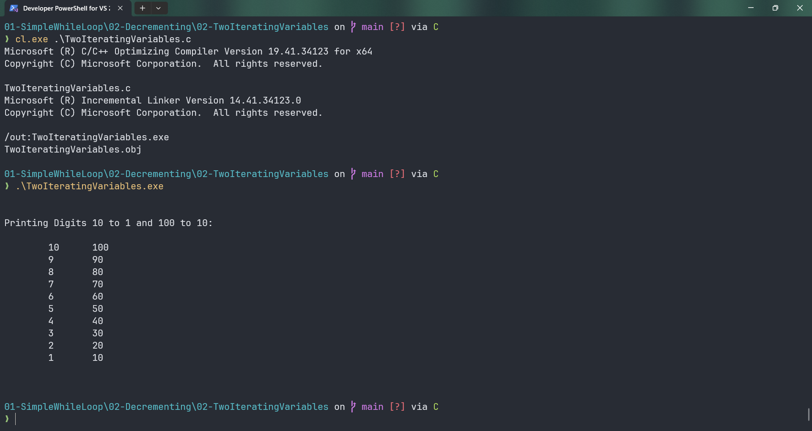

# TwoIteratingVariables

Submitted by Yash Pravin Pawar (RTR2024-023)

## Output Screenshots


## Code
### [TwoIteratingVariables.c](./01-Code/TwoIteratingVariables.c)
```c
#include <stdio.h>

int main(void)
{
    int ypp_i, ypp_j;

    printf("\n\n");
    printf("Printing Digits 10 to 1 and 100 to 10: \n\n");

    ypp_i = 10;
    ypp_j = 100;

    while (ypp_i >= 1 && ypp_j >= 10)
    {
        printf("\t%d\t%d\n", ypp_i, ypp_j);
        ypp_i--;
        ypp_j -= 10;
    }

    printf("\n\n");

    return (0);
}

```
