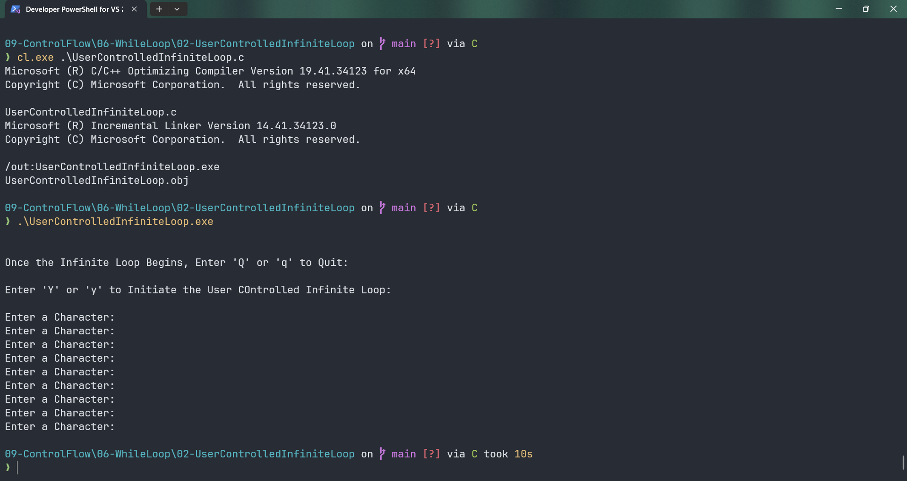

# UserControlledInfiniteLoop

Submitted by Yash Pravin Pawar (RTR2024-023)

## Output Screenshots


## Code
### [UserControlledInfiniteLoop.c](./01-Code/UserControlledInfiniteLoop.c)
```c
// while loop to stop when Q or q is entered
#include <stdio.h>

int main(void)
{
    char ypp_option, ypp_ch = '\0';

    printf("\n\n");
    printf("Once the Infinite Loop Begins, Enter 'Q' or 'q' to Quit: \n\n");
    printf("Enter 'Y' or 'y' to Initiate the User COntrolled Infinite Loop: ");
    printf("\n\n");
    ypp_option = getch();

    if (ypp_option == 'Y' || ypp_option == 'y')
    {
        while (1)
        {
            printf("Enter a Character: ");
            ypp_ch = getch();
            printf("\n");

            if (ypp_ch == 'Q' || ypp_ch == 'q')
            {
                break;
            }
        }
    }
    else
    {
        printf("You Must press 'Y' or 'y' to Initiate the User Controlled Infinite Loop... Please Try Again\n\n");
    }

    return (0);
}
```
