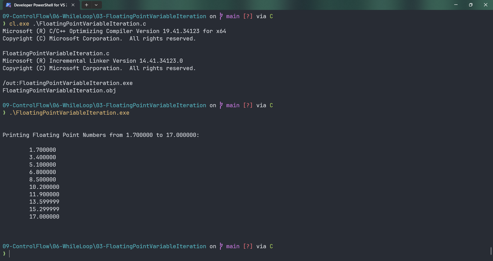

# FloatingPointVariableIteration

Submitted by Yash Pravin Pawar (RTR2024-023)

## Output Screenshots


## Code
### [FloatingPointVariableIteration.c](./01-Code/FloatingPointVariableIteration.c)
```c
#include <stdio.h>

int main(void)
{
    float ypp_f;
    float ypp_f_num = 1.7f;

    printf("\n\n");
    printf("Printing Floating Point Numbers from %f to %f: \n\n", ypp_f_num, ypp_f_num * 10.0f);

    ypp_f = ypp_f_num;
    while (ypp_f <= ypp_f_num * 10.0f)
    {
        printf("\t%f\n", ypp_f);
        ypp_f += ypp_f_num;
    }

    printf("\n\n");

    return (0);
}
```
