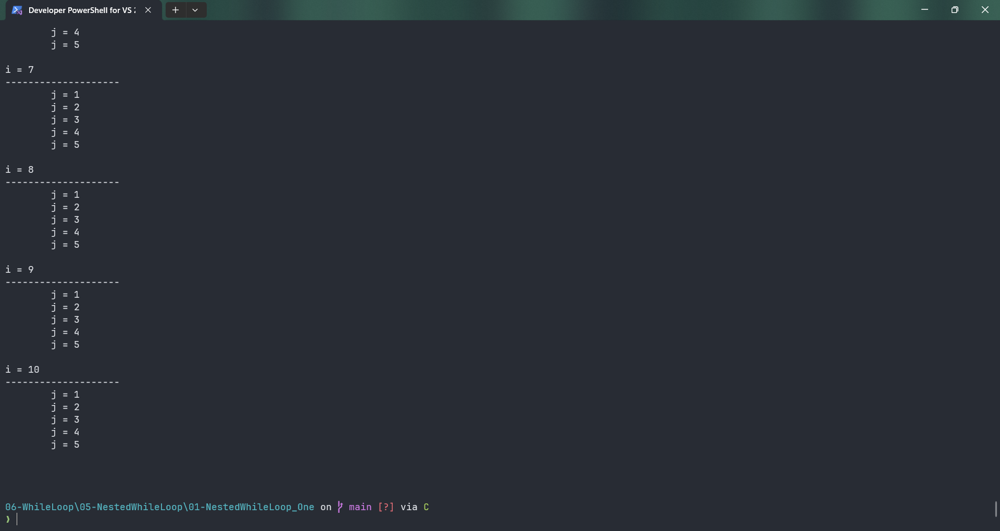
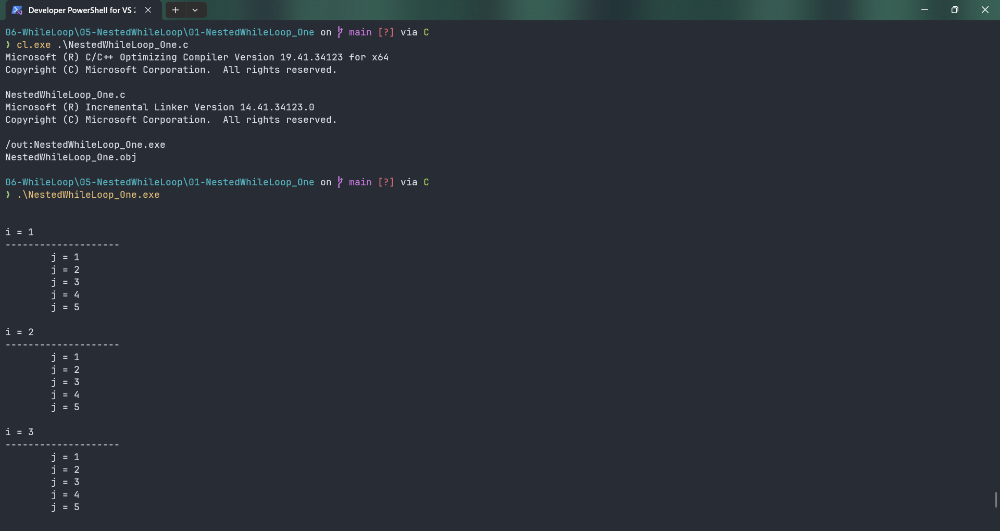
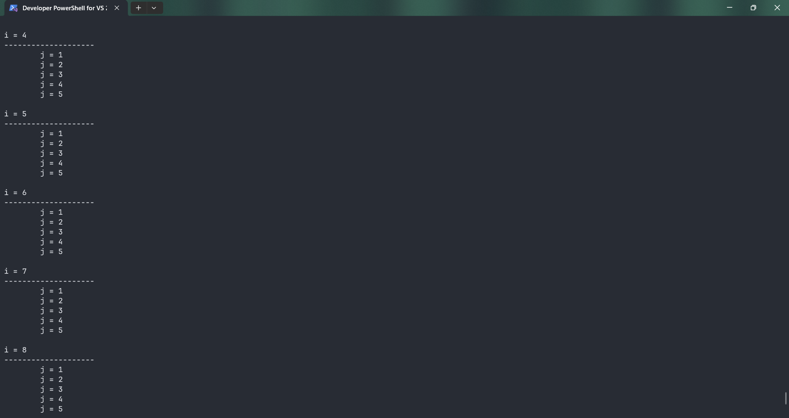

# NestedWhileLoop_One

Submitted by Yash Pravin Pawar (RTR2024-023)

## Output Screenshots




## Code
### [NestedWhileLoop_One.c](./01-Code/NestedWhileLoop_One.c)
```c
#include <stdio.h>

int main(void)
{
    int ypp_i = 1;
    int ypp_j = 1;

    printf("\n\n");

    while (ypp_i <= 10)
    {
        printf("i = %d\n", ypp_i);
        printf("--------------------\n");

        ypp_j = 1;
        while (ypp_j <= 5)
        {
            printf("\tj = %d\n", ypp_j);
            ypp_j++;
        }
        printf("\n");
        ypp_i++;
    }

    printf("\n\n");

    return (0);
}
```
