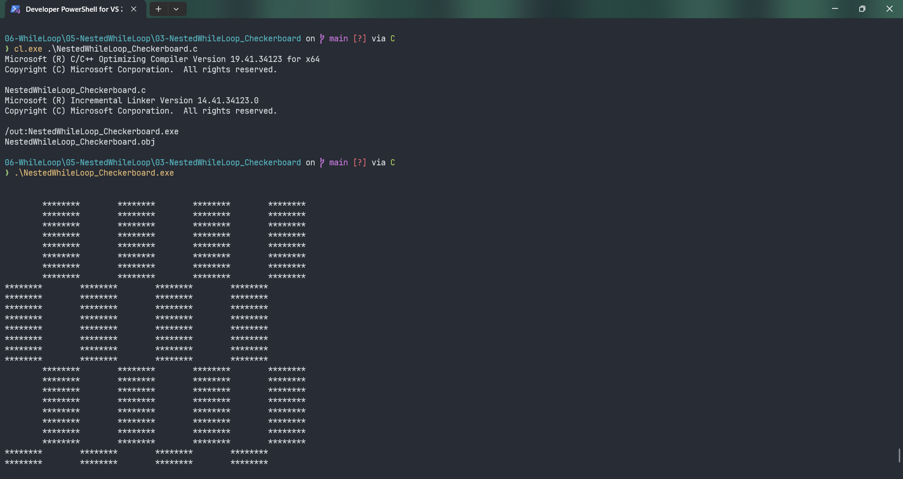

# NestedWhileLoop_Checkerboard

Submitted by Yash Pravin Pawar (RTR2024-023)

## Output Screenshots



## Code
### [NestedWhileLoop_Checkerboard.c](./01-Code/NestedWhileLoop_Checkerboard.c)
```c
#include <stdio.h>

int main(void)
{
    int ypp_i, ypp_j, ypp_c;

    printf("\n\n");

    ypp_i = 0;
    while (ypp_i < 64)
    {
        ypp_j = 0;
        while (ypp_j < 64)
        {
            ypp_c = ((ypp_i & 0x8) == 0) ^ ((ypp_j & 0x8) == 0);

            if (ypp_c)
            {
                printf("*");
            }
            else
            {
                printf(" ");
            }

            ypp_j++;
        }

        printf("\n");
        ypp_i++;
    }
}
```
