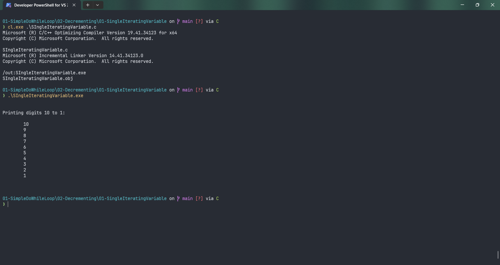

# SIngleIteratingVariable

Submitted by Yash Pravin Pawar (RTR2024-023)

## Output Screenshots


## Code
### [SIngleIteratingVariable.c](./01-Code/SIngleIteratingVariable.c)
```c
#include <stdio.h>

int main(void)
{
    int ypp_i;

    printf("\n\n");
    printf("Printing digits 10 to 1: \n\n");

    ypp_i = 10;
    do 
    {
        printf("\t%d\n", ypp_i);
        ypp_i--;
    } while (ypp_i >= 1);

    printf("\n\n");

    return (0);
}
```
