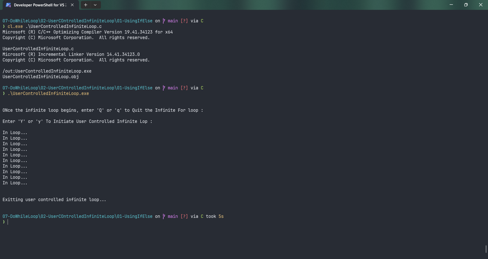

# UserControlledInfiniteLoop

Submitted by Yash Pravin Pawar (RTR2024-023)

## Output Screenshots


## Code
### [UserControlledInfiniteLoop.c](./01-Code/UserControlledInfiniteLoop.c)
```c
#include <stdio.h>

int main(void)
{
    char ypp_option, ypp_ch = '\0';

    printf("\n\n");
    printf("ONce the infinite loop begins, enter 'Q' or 'q' to Quit the Infinite For loop : \n\n");
    printf("Enter 'Y' or 'y' To Initiate User Controlled Infinite Lop : ");
    printf("\n\n");

    ypp_option = getch();

    if (ypp_option == 'Y' || ypp_option == 'y')
    {
        do {
            printf("In Loop...\n");
            ypp_ch = getch();
            if ((ypp_ch == 'Q') || (ypp_ch == 'q'))
                break;
        } while (1);

        printf("\n\n");
        printf("Exitting user controlled infinite loop...");
        printf("\n\n");
    }
    else 
        printf("You Must press 'Y' or 'y' to initiate the user controlled nfinite loop... please try again... \n\n");

    return (0);
}

```
