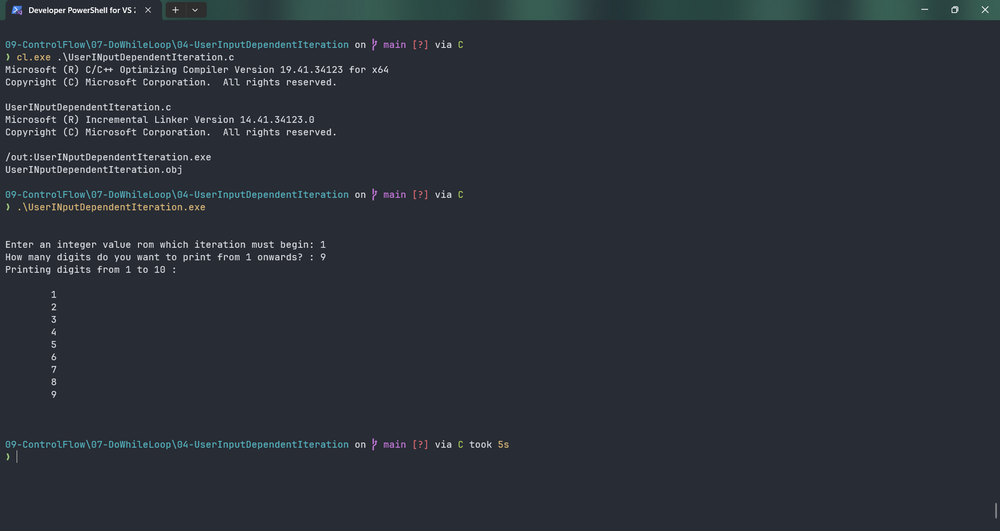

# UserINputDependentIteration

Submitted by Yash Pravin Pawar (RTR2024-023)

## Output Screenshots


## Code
### [UserINputDependentIteration.c](./01-Code/UserINputDependentIteration.c)
```c
#include <stdio.h>

int main(void)
{
    int ypp_i_num, ypp_num, i;

    printf("\n\n");

    printf("Enter an integer value rom which iteration must begin: ");
    scanf("%d", &ypp_i_num);

    printf("How many digits do you want to print from %d onwards? : ", ypp_i_num);
    scanf("%d", &ypp_num);

    printf("Printing digits from %d to %d :\n\n", ypp_i_num, ypp_i_num + ypp_num);

    i = ypp_i_num;
    do {
        printf("\t%d\n", i);
        i++;
    } while (i < ypp_i_num + ypp_num);

    printf("\n\n");

    return (0);
}

```
