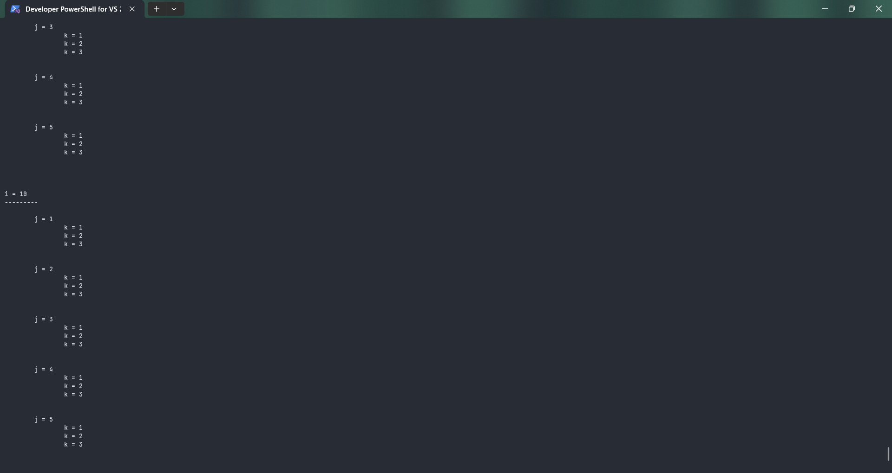
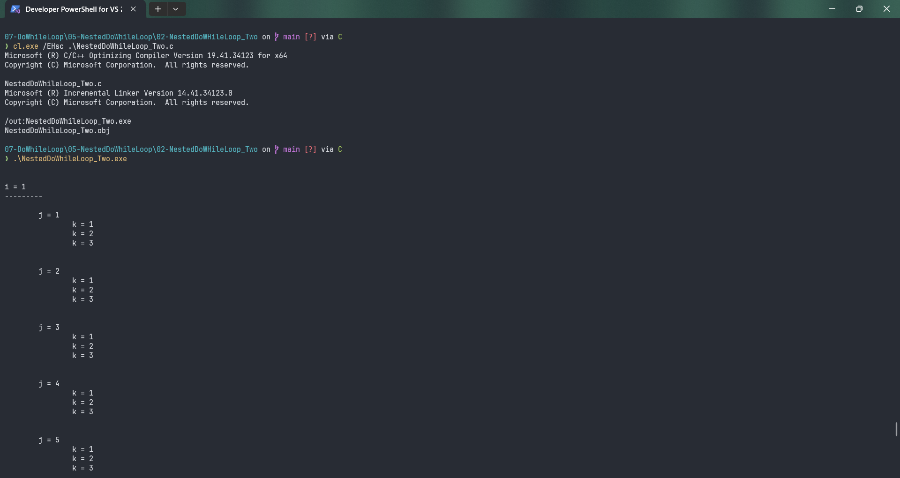
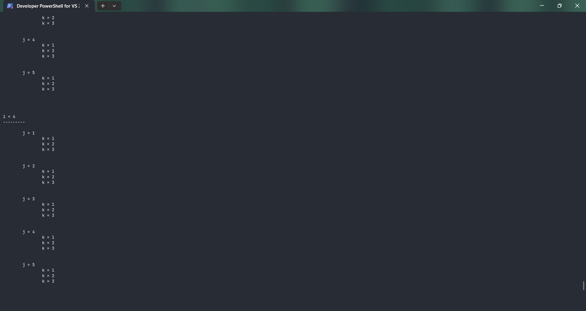
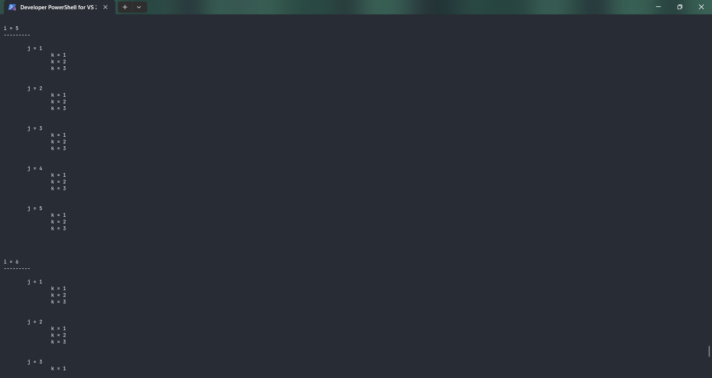
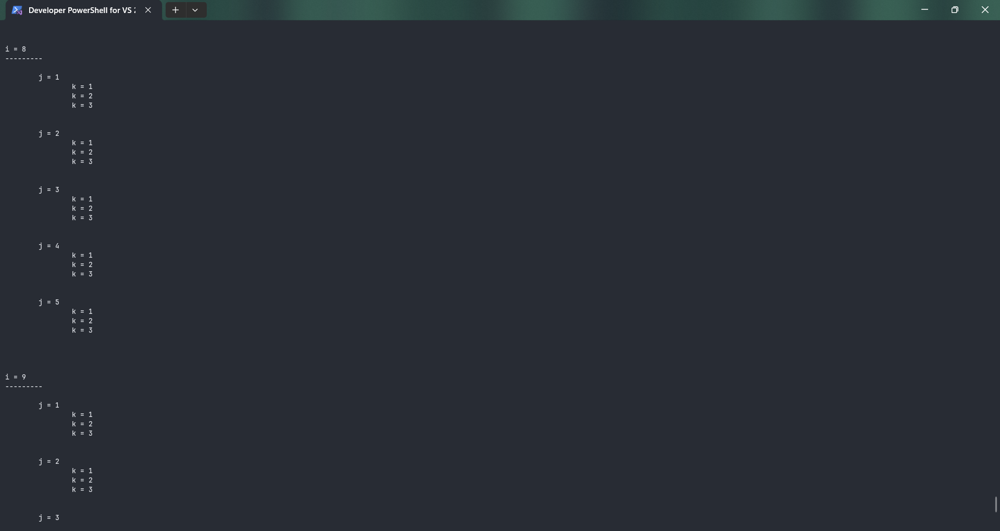

# NestedDoWhileLoop_Two

Submitted by Yash Pravin Pawar (RTR2024-023)

## Output Screenshots








## Code
### [NestedDoWhileLoop_Two.c](./01-Code/NestedDoWhileLoop_Two.c)
```c
#include <stdio.h>

int main(void)
{
    int ypp_i, ypp_j, ypp_k;

    printf("\n\n");

    ypp_i = 1;
    do
    {
        printf("i = %d\n", ypp_i);
        printf("---------\n\n");

        ypp_j = 1;
        do
        {
            printf("\tj = %d\n", ypp_j);

            ypp_k = 1;
            do
            {
                printf("\t\tk = %d\n", ypp_k);
                ypp_k++;
            } while (ypp_k <= 3);

            ypp_j++;
            printf("\n\n");
        } while (ypp_j <= 5);

        ypp_i++;
        printf("\n\n");
    } while (ypp_i <= 10);
    
    return (0);
}

```
