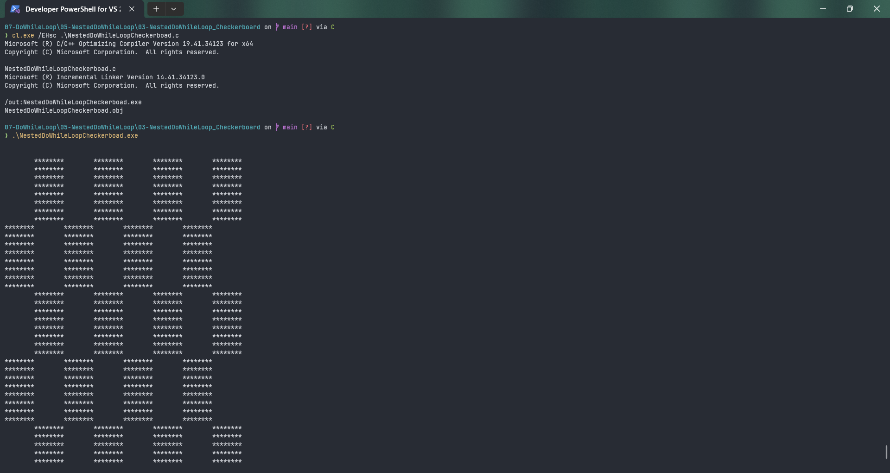
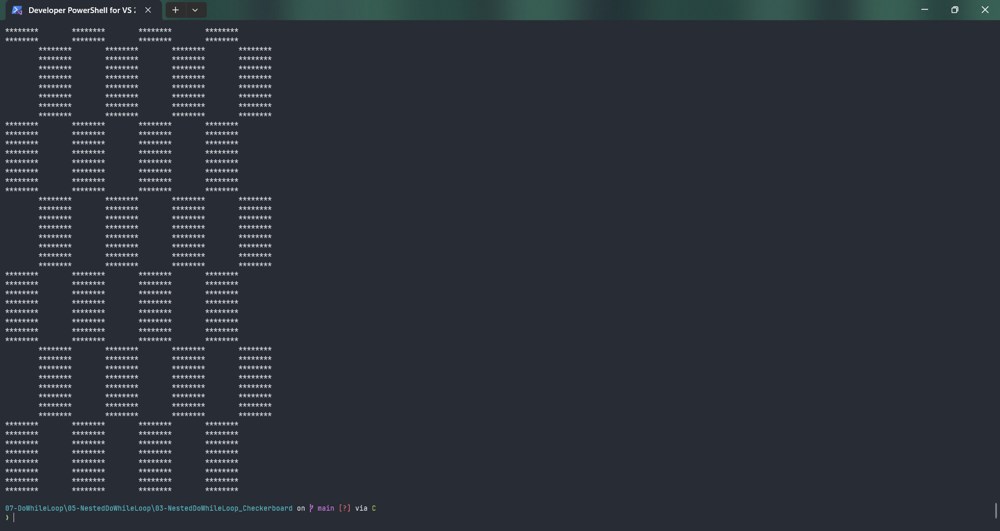

# NestedDoWhileLoopCheckerboad

Submitted by Yash Pravin Pawar (RTR2024-023)

## Output Screenshots



## Code
### [NestedDoWhileLoopCheckerboad.c](./01-Code/NestedDoWhileLoopCheckerboad.c)
```c
#include <stdio.h>

int main(void)
{
    int ypp_i, ypp_j, ypp_c;

    printf("\n\n");

    ypp_i = 0;
    do
    {
        ypp_j = 0;
        do
        {
            ypp_c = (((ypp_i & 0x08) == 0) ^ ((ypp_j & 0x08) == 0));
            if (ypp_c)
            {
                printf("*");
            }
            else
            {
                printf(" ");
            }
            ypp_j++;
        } while (ypp_j < 64);
        printf("\n");
        ypp_i++;
    } while (ypp_i < 64);

    return (0);
}

```
