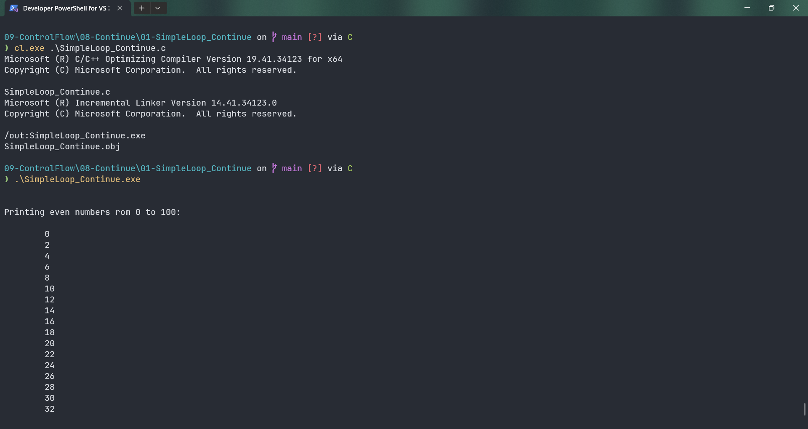
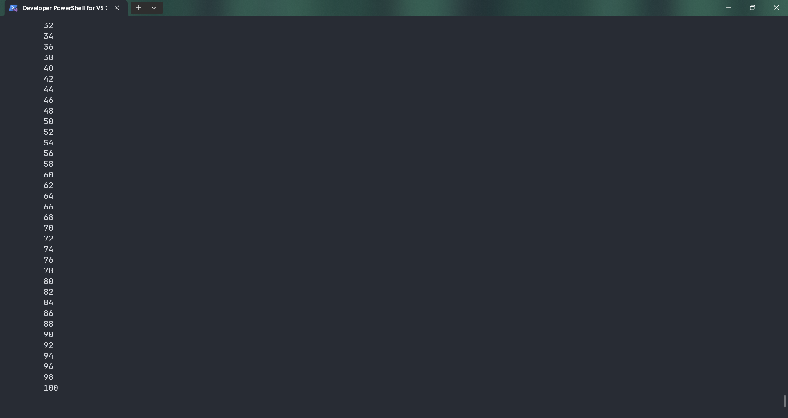

# SimpleLoop_Continue

Submitted by Yash Pravin Pawar (RTR2024-023)

## Output Screenshots



## Code
### [SimpleLoop_Continue.c](./01-Code/SimpleLoop_Continue.c)
```c
#include <stdio.h>

int main(void)
{
    int ypp_i;

    printf("\n\n");

    printf("Printing even numbers rom 0 to 100: \n\n");

    for (ypp_i = 0; ypp_i <= 100; ypp_i++)
    {
        if (ypp_i % 2 != 0)
        {
            continue;
        }
        printf("\t%d\n", ypp_i);
    }

    printf("\n\n");

    return (0);
}
```
