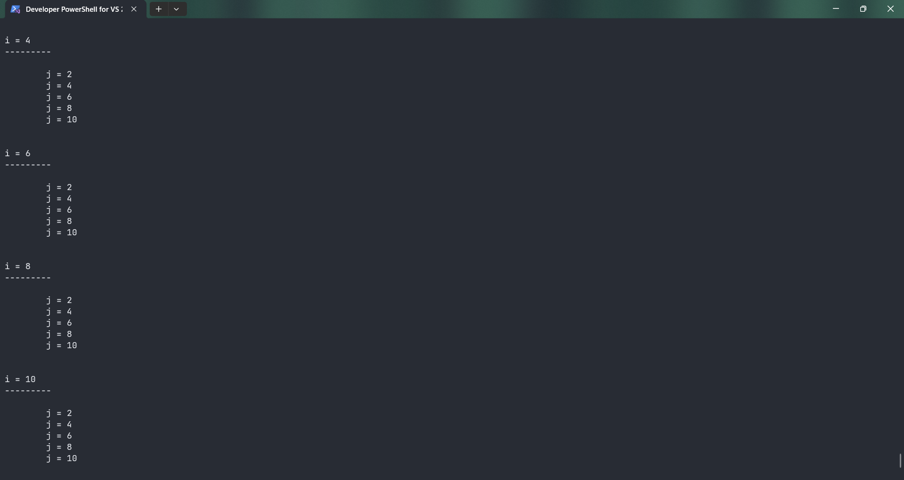
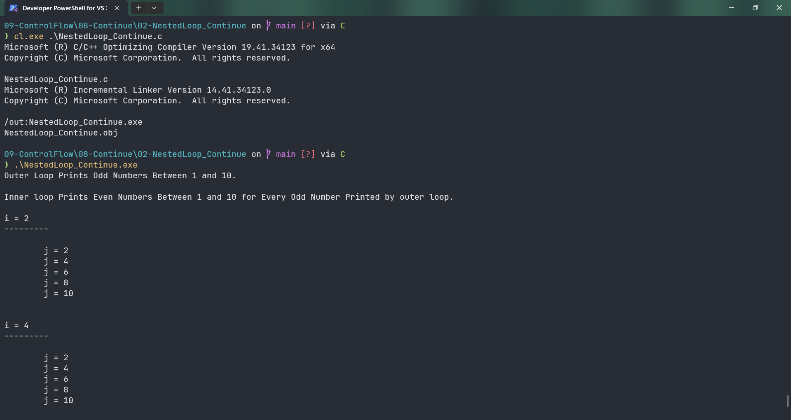

# NestedLoop_Continue

Submitted by Yash Pravin Pawar (RTR2024-023)

## Output Screenshots



## Code
### [NestedLoop_Continue.c](./01-Code/NestedLoop_Continue.c)
```c
#include <stdio.h>

int main(void)
{
    int ypp_i, ypp_j;

    printf("Outer Loop Prints Odd Numbers Between 1 and 10.\n\n");
    printf("Inner loop Prints Even Numbers Between 1 and 10 for Every Odd Number Printed by outer loop.\n\n");

    for (ypp_i = 1; ypp_i <= 10; ypp_i++)
    {
        if (ypp_i % 2 == 0)
        {
            printf("i = %d\n", ypp_i);
            printf("---------\n\n");

            for (ypp_j = 1; ypp_j <= 10; ypp_j++)
            {
                if (ypp_j % 2 == 0)
                {
                    printf("\tj = %d\n", ypp_j);
                }
                else 
                {
                    continue;
                }
            }
            printf("\n\n");
        }
        else 
        {
            continue;
        }
    }

    printf("\n\n");

    return (0);
}
```
