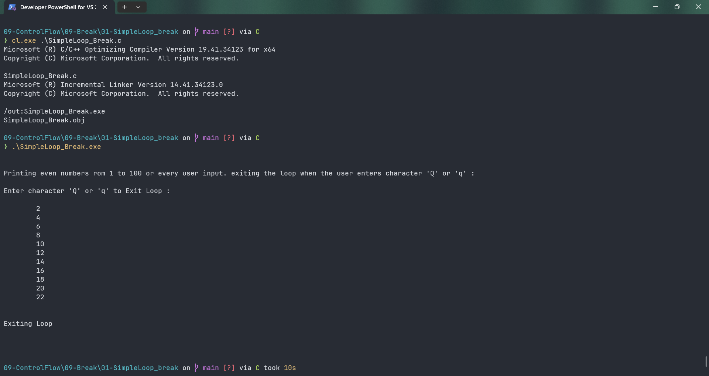

# SimpleLoop_Break

Submitted by Yash Pravin Pawar (RTR2024-023)

## Output Screenshots


## Code
### [SimpleLoop_Break.c](./01-Code/SimpleLoop_Break.c)
```c
#include <stdio.h>
#include <conio.h>

int main(void)
{
    int i;
    char ypp_ch;

    printf("\n\n");

    printf("Printing even numbers rom 1 to 100 or every user input. exiting the loop when the user enters character 'Q' or 'q' : \n\n");
    printf("Enter character 'Q' or 'q' to Exit Loop : \n\n");

    for (i = 1; i <= 100; i++)
    {
        if (i % 2 != 0)
        {
            continue;
        }
        printf("\t%d\n", i);

        ypp_ch = getch();
        if (ypp_ch == 'Q' || ypp_ch == 'q')
        {
            break;
        }
        
    }

    printf("\n\n");
    printf("Exiting Loop\n\n");
    printf("\n\n");

    return (0);
}

```
