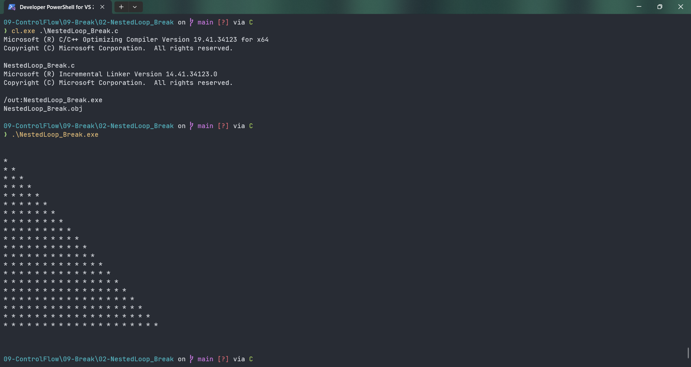

# NestedLoop_Break

Submitted by Yash Pravin Pawar (RTR2024-023)

## Output Screenshots


## Code
### [NestedLoop_Break.c](./01-Code/NestedLoop_Break.c)
```c
#include <stdio.h>
#include <conio.h>

int main(void)
{

    int ypp_i, ypp_j;
    
    printf("\n\n");

    for (ypp_i = 1; ypp_i <= 20; ypp_i++)
    {
        for (ypp_j = 1; ypp_j <= 20; ypp_j++)
        {
            if (ypp_j > ypp_i)
            {
                break;
            }
            else
                printf("* ");
        }

        printf("\n");
    }

    printf("\n\n");

    return (0);
}
```
