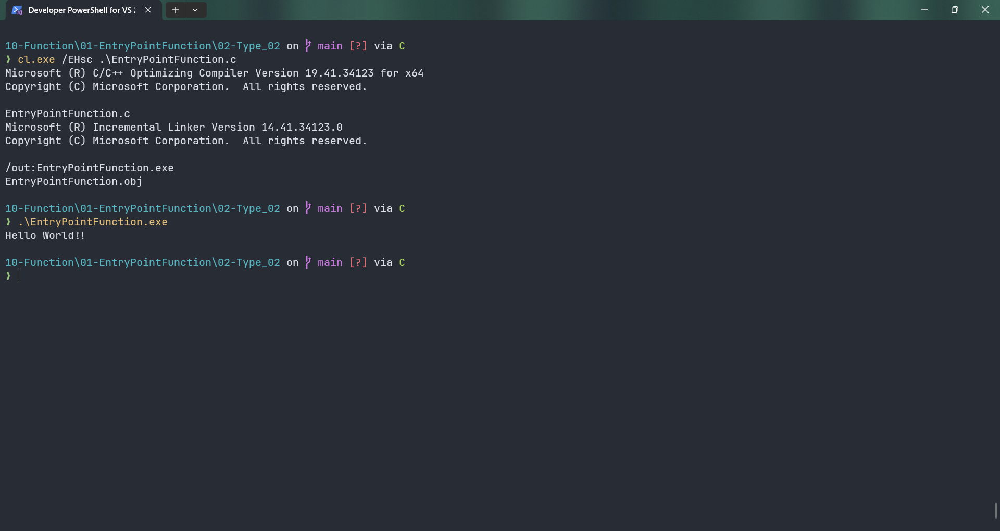

# EntryPointFunction

Submitted by Yash Pravin Pawar (RTR2024-023)

## Output Screenshots


## Code
### [EntryPointFunction.c](./01-Code/EntryPointFunction.c)
```c
#include <stdio.h>

int main(void)
{
    printf("Hello World!!\n");
    return (0);
}

```
