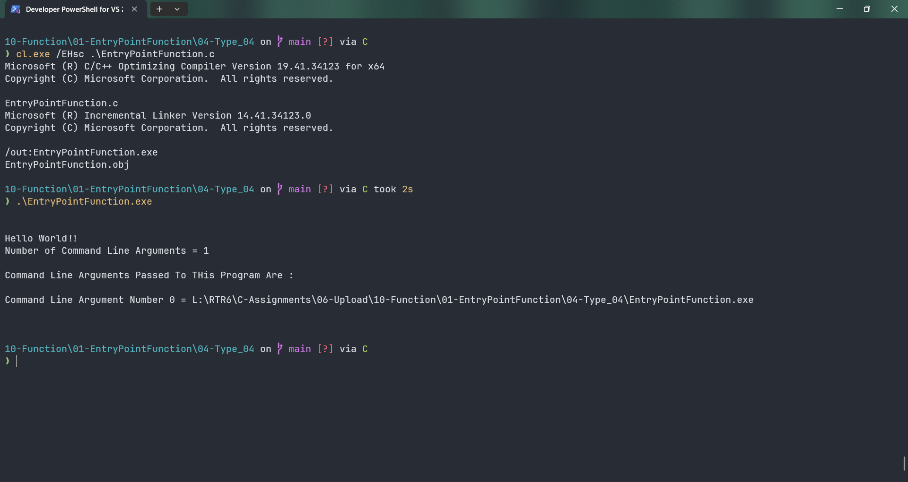

# EntryPointFunction

Submitted by Yash Pravin Pawar (RTR2024-023)

## Output Screenshots


## Code
### [EntryPointFunction.c](./01-Code/EntryPointFunction.c)
```c
#include <stdio.h>

int main(int argc, char *argv[])
{
    int i;

    printf("\n\n");
    printf("Hello World!!\n");
    printf("Number of Command Line Arguments = %d\n\n", argc);

    printf("Command Line Arguments Passed To THis Program Are : \n\n");
    for (i = 0; i < argc; i++)
    {
        printf("Command Line Argument Number %d = %s\n", i, argv[i]);
    }
    printf("\n\n");

    return (0);
}

```
