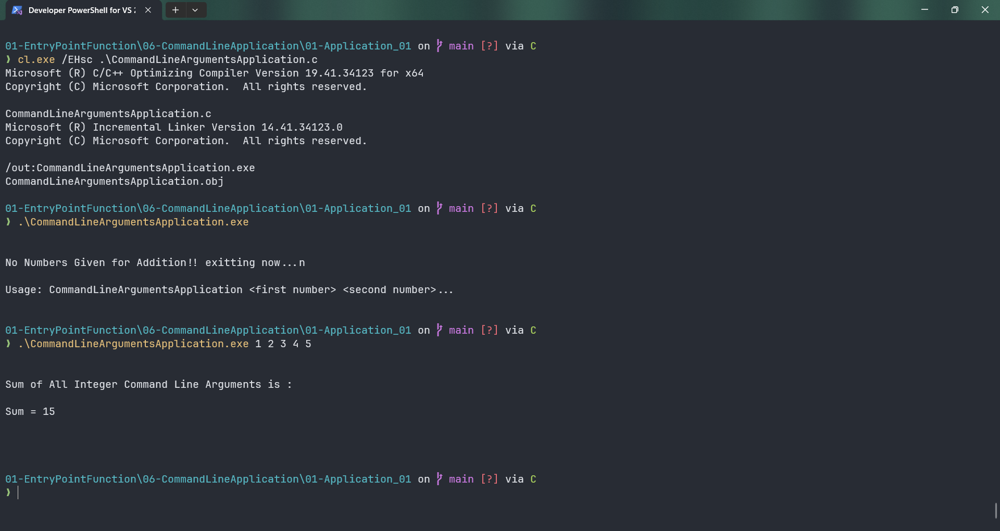

# CommandLineArgumentsApplication

Submitted by Yash Pravin Pawar (RTR2024-023)

## Output Screenshots


## Code
### [CommandLineArgumentsApplication.c](./01-Code/CommandLineArgumentsApplication.c)
```c
#include <stdio.h>
#include <ctype.h>
#include <stdlib.h>

int main(int ypp_argc, char *ypp_argv[], char *ypp_envp[])
{
    int i;
    int num;
    int sum = 0;

    if (ypp_argc == 1)
    {
        printf("\n\n");
        printf("No Numbers Given for Addition!! exitting now...n\n\n");
        printf("Usage: CommandLineArgumentsApplication <first number> <second number>...\n\n");
        exit(0);
    }

    printf("\n\n");

    printf("Sum of All Integer Command Line Arguments is :\n\n");
    for (i = 1; i < ypp_argc; i++)
    {
        num = atoi(ypp_argv[i]);
        sum += num;
    }

    printf("Sum = %d\n\n", sum);

    printf("\n\n");

    return (0);
}

```
