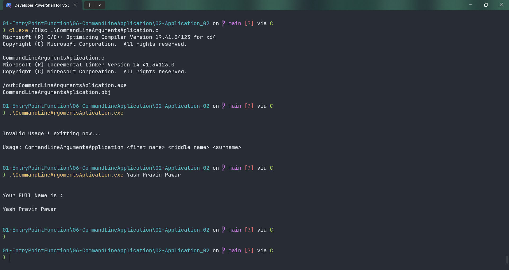

# CommandLineArgumentsAplication

Submitted by Yash Pravin Pawar (RTR2024-023)

## Output Screenshots


## Code
### [CommandLineArgumentsAplication.c](./01-Code/CommandLineArgumentsAplication.c)
```c
#include <stdio.h>
#include <stdlib.h>

int main(int ypp_argc, char* ypp_argv[], char* ypp_envp[])
{
    int i;

    if (ypp_argc != 4)
    {
        printf("\n\n");
        printf("Invalid Usage!! exitting now...\n\n");
        printf("Usage: CommandLineArgumentsApplication <first name> <middle name> <surname>\n\n");
        exit(0);
    }

    printf("\n\n");

    printf("Your FUll Name is :\n\n");
    for (i = 1; i < ypp_argc; i++)
    {
        printf("%s ", ypp_argv[i]);
    }

    printf("\n\n");

    return (0);
}

```
