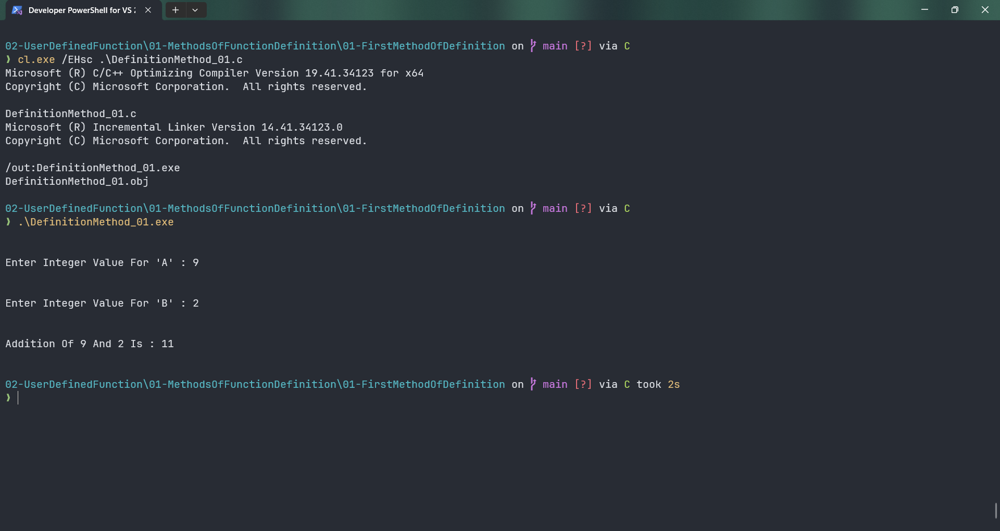

# DefinitionMethod_01

Submitted by Yash Pravin Pawar (RTR2024-023)

## Output Screenshots


## Code
### [DefinitionMethod_01.c](./01-Code/DefinitionMethod_01.c)
```c
#include <stdio.h>

int main(int argc, char *argv[], char *envp[]) 
{
    void MyAddition(void);

    MyAddition();

    return (0);
}

void MyAddition(void)
{
    int a, b, sum;

    printf("\n\n");
    printf("Enter Integer Value For 'A' : ");
    scanf("%d", &a);    

    printf("\n\n");
    printf("Enter Integer Value For 'B' : ");
    scanf("%d", &b);

    sum = a + b;

    printf("\n\n");
    printf("Addition Of %d And %d Is : %d\n\n", a, b, sum);
}

```
