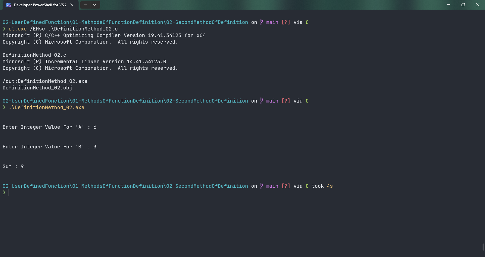

# DefinitionMethod_02

Submitted by Yash Pravin Pawar (RTR2024-023)

## Output Screenshots


## Code
### [DefinitionMethod_02.c](./01-Code/DefinitionMethod_02.c)
```c
#include <stdio.h>

int main(int argc, char *argv[], char *envp[]) 
{
    int MyAddition(void);
    int result;

    result = MyAddition();

    printf("\n\n");
    printf("Sum : %d\n\n", result);

    return (0);
}

int MyAddition(void)
{
    int a, b, sum;

    printf("\n\n");
    printf("Enter Integer Value For 'A' : ");
    scanf("%d", &a);    

    printf("\n\n");
    printf("Enter Integer Value For 'B' : ");
    scanf("%d", &b);

    sum = a + b;

    return (sum);
}

```
