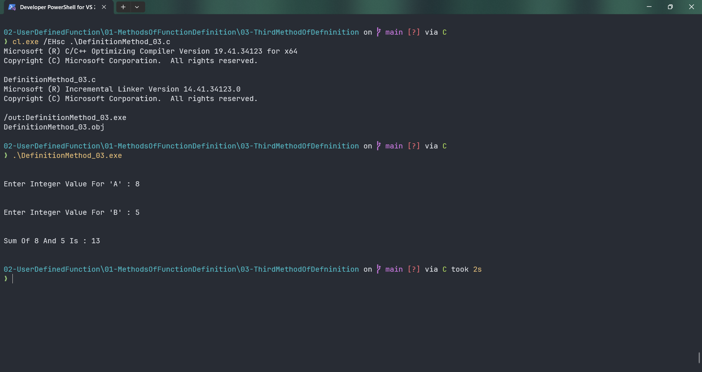

# DefinitionMethod_03

Submitted by Yash Pravin Pawar (RTR2024-023)

## Output Screenshots


## Code
### [DefinitionMethod_03.c](./01-Code/DefinitionMethod_03.c)
```c
#include <stdio.h>

int main(int argc, char *argv[], char *envp[])
{
    void MyAddition(int, int);
    int a, b;

    printf("\n\n");
    printf("Enter Integer Value For 'A' : ");
    scanf("%d", &a);

    printf("\n\n");
    printf("Enter Integer Value For 'B' : ");
    scanf("%d", &b);

    MyAddition(a, b);

    return (0);
}

void MyAddition(int a, int b)
{
    int sum;

    sum = a + b;

    printf("\n\n");
    printf("Sum Of %d And %d Is : %d\n\n", a, b, sum);
}

```
