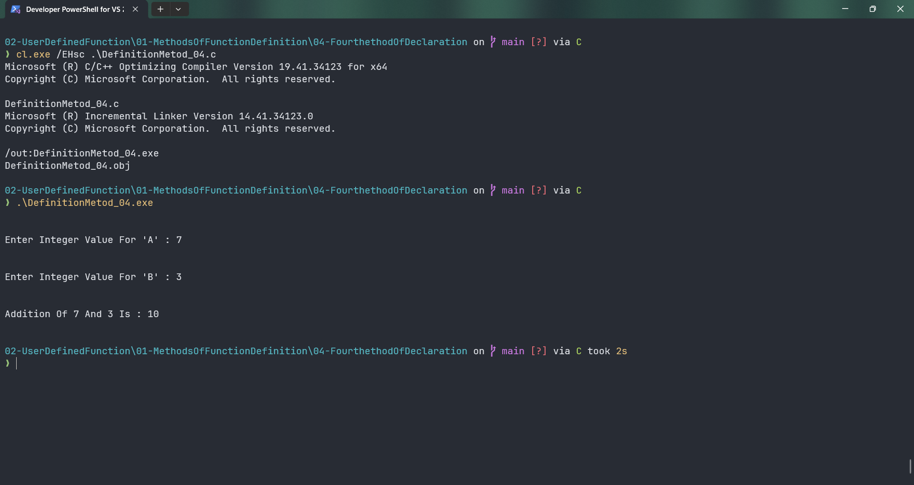

# DefinitionMetod_04

Submitted by Yash Pravin Pawar (RTR2024-023)

## Output Screenshots


## Code
### [DefinitionMetod_04.c](./01-Code/DefinitionMetod_04.c)
```c
#include <stdio.h>

int main(int argc, char *argv[], char * envp[])
{
    int MyAddition(int, int);

    int a, b, result;

    printf("\n\n");
    printf("Enter Integer Value For 'A' : ");
    scanf("%d", &a);    

    printf("\n\n");
    printf("Enter Integer Value For 'B' : ");
    scanf("%d", &b);

    result = MyAddition(a, b);

    printf("\n\n");
    printf("Addition Of %d And %d Is : %d\n\n", a, b, result);

    return (0);
}

int MyAddition(int a, int b)
{
    int sum;
    sum = a + b;

    return (sum);
}

```
