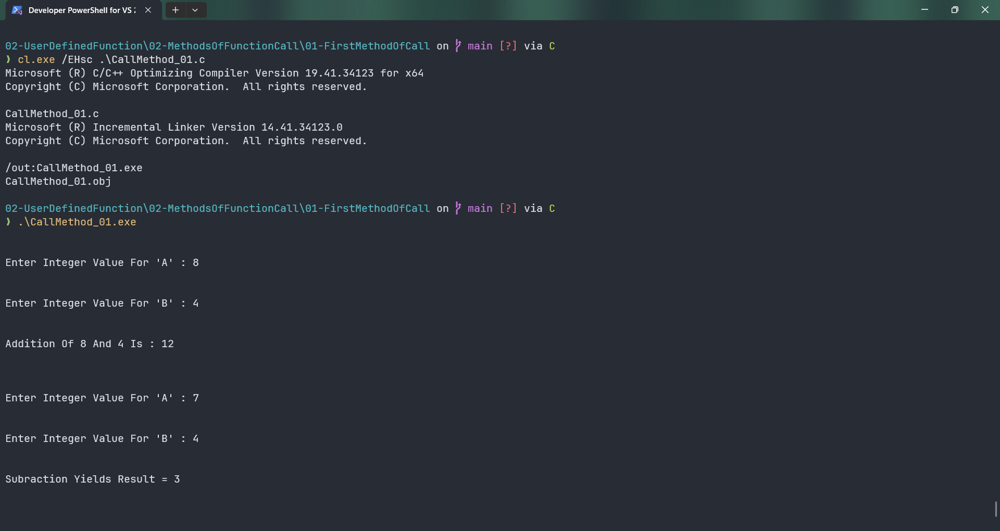
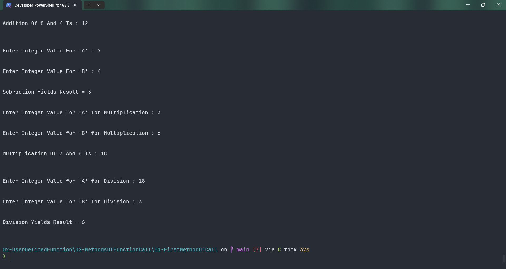

# CallMethod_01

Submitted by Yash Pravin Pawar (RTR2024-023)

## Output Screenshots



## Code
### [CallMethod_01.c](./01-Code/CallMethod_01.c)
```c
#include <stdio.h>

int main(int argc, char *argv[], char *envp[])
{
    void MyAddition(void);
    int MySubtraction(void);
    void MyMultiplication(int, int);
    int MyDivision(int, int);

    int ypp_result_subtraction;
    int ypp_a_multiplication, ypp_b_multiplication;
    int ypp_a_division, ypp_b_division, ypp_result_division;

    MyAddition();

    ypp_result_subtraction = MySubtraction();
    printf("\n\n");
    printf("Subraction Yields Result = %d\n", ypp_result_subtraction);

    printf("\n\n");
    printf("Enter Integer Value for 'A' for Multiplication : ");
    scanf("%d", &ypp_a_multiplication);

    printf("\n\n");
    printf("Enter Integer Value for 'B' for Multiplication : ");
    scanf("%d", &ypp_b_multiplication);

    MyMultiplication(ypp_a_multiplication, ypp_b_multiplication);

    printf("\n\n");
    printf("Enter Integer Value for 'A' for Division : ");
    scanf("%d", &ypp_a_division);

    printf("\n\n");
    printf("Enter Integer Value for 'B' for Division : ");
    scanf("%d", &ypp_b_division);

    ypp_result_division = MyDivision(ypp_a_division, ypp_b_division);

    printf("\n\n");
    printf("Division Yields Result = %d\n", ypp_result_division);
    printf("\n\n");

    return (0);
}

void MyAddition(void)
{
    int a, b, sum;

    printf("\n\n");
    printf("Enter Integer Value For 'A' : ");
    scanf("%d", &a);

    printf("\n\n");
    printf("Enter Integer Value For 'B' : ");
    scanf("%d", &b);

    sum = a + b;

    printf("\n\n");
    printf("Addition Of %d And %d Is : %d\n\n", a, b, sum);
}

int MySubtraction(void)
{
    int a, b, subraction;

    printf("\n\n");
    printf("Enter Integer Value For 'A' : ");
    scanf("%d", &a);

    printf("\n\n");
    printf("Enter Integer Value For 'B' : ");
    scanf("%d", &b);

    subraction = a - b;

    return (subraction);
}

void MyMultiplication(int a, int b)
{
    int multiplication;

    multiplication = a * b;

    printf("\n\n");
    printf("Multiplication Of %d And %d Is : %d\n\n", a, b, multiplication);
}

int MyDivision(int a, int b)
{
    int division_quotient;

    if (a > b)
        division_quotient = a / b;
    else
        division_quotient = b / a;

    return (division_quotient);
}

```
